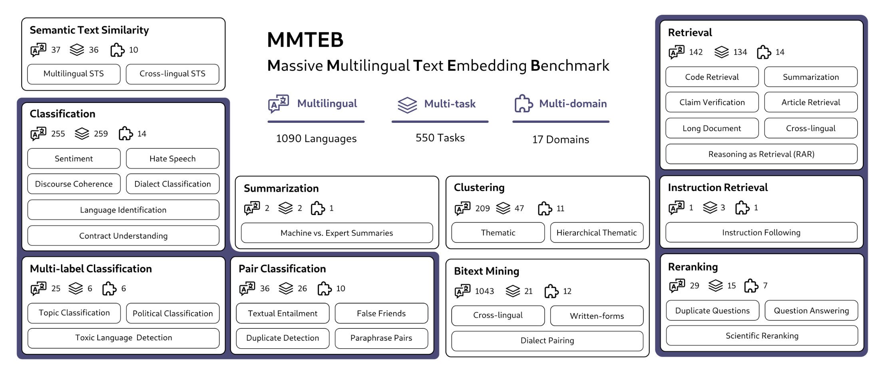

+++
title = "MMTEB: Embeddingのための新しい多言語ベンチマーク"
date = "2025-03-20"

[taxonomies]
categories = ["Short Posts"]
tags = ["til", "embedding", "benchmark"]
+++

最近のEmbeddingモデルについて調べていて，[MMTEB (Massive Multilingual Text Embedding Benchmark)](https://huggingface.co/papers/2502.13595)という，Text Embeddingのための新しい多言語ベンチマークがリリースされていることを知った。前身のMTEBというベンチマークにタスクと言語をたくさん追加したものらしい。ICLR2025にアクセプトされたペーパーなので，かなり新しい。

実世界のさまざまなユースケースと言語をカバーするため，10個のタスクカテゴリ（ファミリー）があり，タスクの総数は全部で500個以上，言語はBitextMiningで1050言語，その他のタスクカテゴリで250言語を含んでいる。Massiveを謳うだけあってかなりの規模。言語によってタスク数が異なり，日本語だと35タスクで入手できる。

[リーダーボード](https://huggingface.co/spaces/mteb/leaderboard)を見ると，上位には`gemini-embedding-exp-03-07`, `Linq-Embed-Mistral`, `gte-Qwen2-7B-instruct`, `multilingual-e5-large-instruct`といったモデルが並んでいて(2025/3/20現在)，SoTAモデルをさっと調べるのに良さそう。

[文献](https://arxiv.org/abs/2502.13595)をざっと眺めると，データセット構築手法に加えて，低コストでベンチマークを実行するためのdownsamplingにも触れられている（愚直に実行したら，embedding生成でものすごいコストがかかるらしい）。
