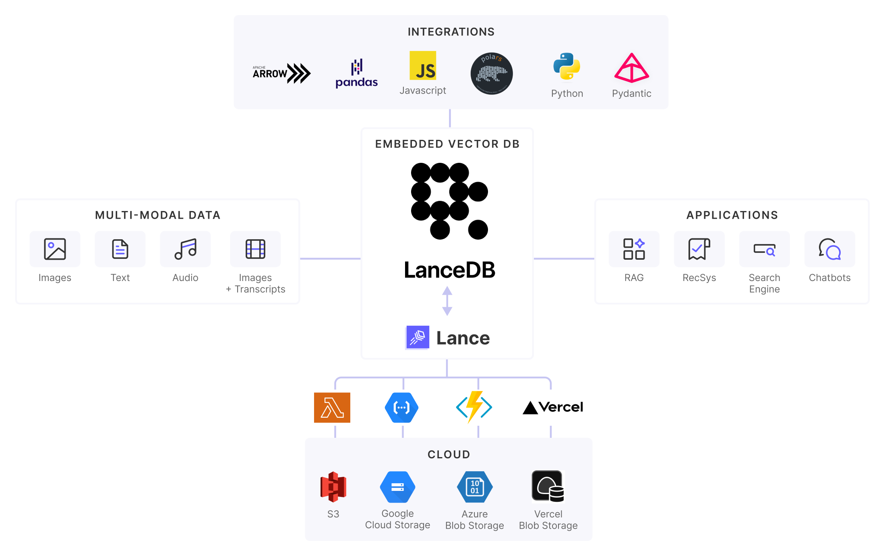

+++
title = "今からRAGを始めるなら，LanceDBがいいんじゃないかなと思った話"
date = "2025-06-29"

[taxonomies]
categories = ["Short Posts"]
tags = ["til", "lancedb", "RAG", "emedding"]

[extra]
cover = "lancedb_and_lance.png"
+++

[LanceDB](https://github.com/lancedb/lancedb) という，比較的後発のOSSベクトルデータベースがあります。名前はうっすら聞いたことがあったものの，たくさんあるembedding検索エンジンのひとつ，というくらいの認識しかなかったのですが，少し触ってみて，完成度の高さにいい意味で驚かされたので紹介したいと思います。

LanceDBは，アプリケーションエンベッドもしくはサーバーレスで動く，高機能ベクトルデータベースです。ここで「サーバーレス」とは，データ（インデックス）はネットワークファイルシステムやオブジェクトストレージ（S3やGCS）といったストレージバックエンドに置かれていて，LanceDBのプロセス自体はステートレスで動作する，といった意味合いのようです。データベースや検索エンジンで，最近こういった設計が増えてきました。コアはRustで書かれていて，PythonやTypeScriptなどの言語のバインディングが提供されています。

このDBのすごいところはサポートする機能の豊富さで，[ガイド](lancedb.github.io/lancedb/guides/tables/)を眺めると，本格的なRAGを作ろうとしたときに必要な機能がひととおり全部入りとなっています（一部実験的な機能もある様子）。

<!-- more -->

- マルチモーダルembeddingをネイティブサポート
- embedding検索と全文検索とのハイブリッド検索
- Late interaction (ColBERT) のサポート
- Rerankerのサポート
- 列指向データベースでもあって，SQLがサポートするようなフィルタリングはだいたいできる
- Pandas, DuckDB，Datafusion, LangChain, LlamaIndex などML/Data/AIエコシステムとの連携が豊富
- etc.

また，開発者目線で面白いのが，LanceDBのコアエンジン部分である，列指向データフォーマット[Lance](https://github.com/lancedb/lance)が独立したOSSとして公開されているところです。ソフトウェアレイヤーとしては[Parquet](https://parquet.apache.org/)に相当し，Parquetよりもランダムディスクアクセスが１００倍高速で，MLワークロードに最適化されている，と謳っています。ベクトルデータベースという点では，Lanceが近似最近傍探索アルゴリズムIVF-PQとHNSWをサポートしていて，LanceDBがそのラッパーI/Fを提供しているという位置づけになります。

アプリケーションエンベッドDBとしてプロトタイピング，開発とテストをして，S3にデータを載せたらプロダクション環境へGo，という使い方ができる（はず）ので，小中規模のRAGシステム開発で重宝しそうです。まだドキュメンテーションをざっと眺めて，Getting Startedを動かしてみた程度ですが，これから機能を深堀りしたり，実装も読んでいきたいなという所存。