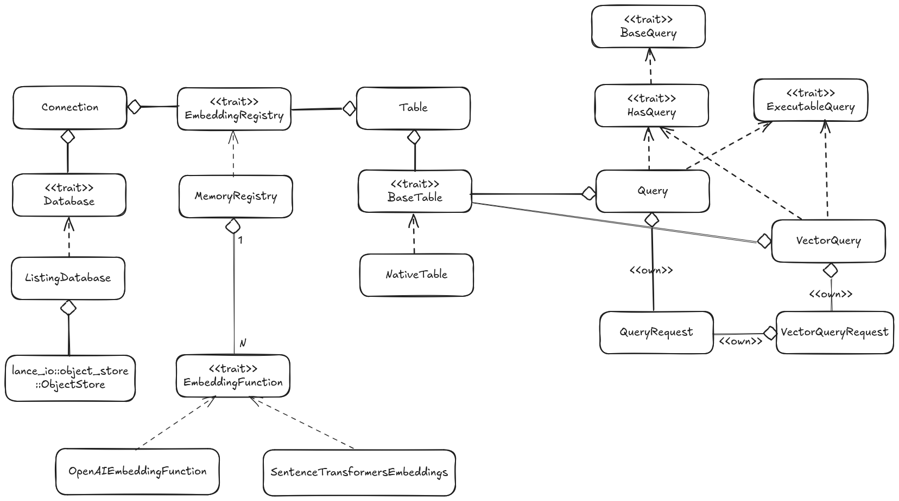

+++
title = "LanceDBのアーキテクチャ"
date = "2025-09-15"

[taxonomies]
categories = ["Short Posts"]
tags = ["til", "LanceDB", "Rust"]

[extra]
cover = "lancedb-class-diagram.png"
+++

[LanceDB](https://github.com/lancedb/lancedb) のソースコードを少しずつ読み始めていて，主なstructとtraitの関係をざっと図にしてみました。UMLのクラス図に雰囲気似せていますが，Rustにいわゆる「クラス」はないので，あくまで，関係をUMLっぽく可視化した図です。

図の，クラスのように見える箱は，structまたはtraitを表しています。点線の矢印は，あるstructが矢印の先のtraitを`impl`していることを表しています。ひし形の矢印（所有）は，refence count (ARC) を介した所有関係を表しています。`<<own>>` とラベルがついているのは，reference countではない，通常の所有権を表しています。

なおこの図では，LanceDBのOSS版のみを対象としていて，LanceDB Cloudのクラスは含んでいません。

## 主要なstruct/trait

- `lancedb::connection::Connection`: データベースへの接続を管理するstruct。一度接続すると，別のデータベースに接続を切り替えることはできないため，実質データベースと同じ。
- `lancedb::database::Database`: データベースを表すtrait。
- `lancedb::database::listing::ListingDatabase`: `Database`の，ファイルシステムライクなストレージ（ローカルファイルシステムやオブジェクトストレージ）をベースとした実装。ひとつのディレクトリに対応する。
- `lancedb::table::Table`と`lancedb::table::BaseTable`: テーブルを表すstructとtrait。
- `lancedb::table::NativeTable`: `BaseTable`の，ファイルシステムライクなストレージをベースとした実装。ひとつのファイルに対応する。
- `lancedb::embeddings::EmbeddingRegistry`と`lancedb::embeddings::MemoryRegistry`: embeddingモデルのレジストリを表すtraitとその実装。
- `lancedb::embeddings::EmbeddingFunction`: embeddingモデルを表すtrait。各種embeddingモデルはこのtraitを`impl`する。
- `lancedb::query::Query`と`lancedb::query::VectorQuery`: スカラークエリ及び全文検索クエリを表すstructと，ベクトル検索クエリを表すstruct。query周りは込み入っていて，インタフェースがあまり整理されていない印象。

## 関連プロジェクト

LanceDBは自体は，以下のコア処理を行うライブラリのファサードとして機能します。
そのため，LanceDBのコードベース自体はそれほど大きくないですが，深く理解するにはこれらもまとめて理解する必要があり，先は長そう。

### [Lance](https://github.com/lancedb/lance)

列指向データフォーマット／データベースエンジン。

### [Apache Arrow](https://github.com/apache/arrow)

列指向データフォーマットのメモリ表現と，それを操作するためのライブラリ群。Rustのバインディングは [arrow-rs](https://github.com/apache/arrow-rs/)。

### [Apache DataFusion](https://github.com/apache/datafusion)

Rustで実装されたSQLクエリエンジン。

