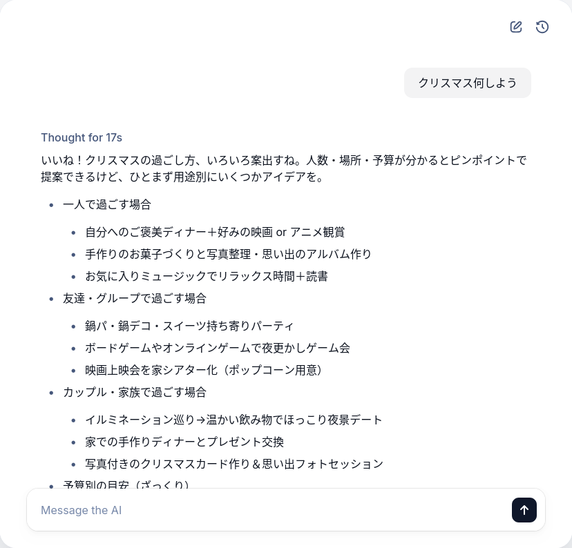

+++
title = "Hello ChatKit! ~ ミニマムなチャットWebアプリを作る"
date = "2025-12-04"

[taxonomies]
categories = ["Short Posts"]
tags = ["til", "agents", "openai", "chatkit"]
+++

[前回](https://blog.mocobeta.dev/posts/20251203-agents-memory/)まではAgents SDKだけを使って，コマンドラインで動作する対話エージェントを作りました。WebアプリケーションのチャットGUIのためのツールキットとして，[ChatKit](https://platform.openai.com/docs/guides/chatkit)があります。本エントリでは，前回作ったエージェントにミニマムなWeb GUIをつけてみます。

## ChatKitとは

AIエージェントのチャットアプリを作るのに必要なフロントエンド，バックエンドの機能をフルセットで提供するアプリケーションフレームワーク。カスタマイズ性が高くて機能がすごくたくさん（語彙が足りない）あります。

## とりあえず手を動かす

ChatKitのバックエンドは，

- Agent Builderというノーコードツールでエージェントワークフローを作ってOpenAIのプラットフォームにデプロイする方法
- ChatKit SDKを使ってFast APIサーバーを立てて，自前のバックエンドを実装する方法（advanced）

の2通りがあります。ノーコードツールのほうは詳しくなるモチベーションが湧かなかったので，最初からadvancedな方法でやってみます。

とはいえGUIのチャットアプリとなるとやはり複雑で，ほどよいクイックスタート的なガイドが見当たらず，スクラッチで書くのも公式で提供されているexampleを改変するのも，手こずりました...。

### フロントエンド

最新のフロントエンドにだいぶ疎いので，[公式のexampleリポジトリ](https://github.com/openai/openai-chatkit-advanced-samples/tree/main)からコピーして，勘でいじりました。

### バックエンド

`openai-chatkit==1.4.0`時点の，「とりあえずチャットができる」最小限のバックエンドのコードを書きました。（SDKアップグレードでおそらくアグレッシブに変わる。）エージェント部分はAgents SDKなので，前回作ったエージェントを流用しています。

```python
# server.py
# ChatKitサーバー本体
from __future__ import annotations

import logging
from typing import Any, AsyncIterator

from agents import Runner, Agent
from chatkit.agents import stream_agent_response, ThreadItemConverter, AgentContext
from chatkit.server import ChatKitServer
from chatkit.types import (
    ThreadMetadata,
    ThreadStreamEvent,
    UserMessageItem,
)

from .memory_store import MemoryStore

logging.basicConfig(level=logging.INFO)

agent = Agent(
    name="My Agent",
    instructions="日本語で簡潔にフレンドリーに答えてください。",
    model="gpt-5-nano",
)

class MyChatKitServer(ChatKitServer[dict[str, Any]]):

    def __init__(self) -> None:
        self.store: MemoryStore = MemoryStore()
        super().__init__(self.store)

        self.thread_item_converter = ThreadItemConverter()

    async def respond(
        self,
        thread: ThreadMetadata,
        item: UserMessageItem | None,
        context: dict[str, Any],
    ) -> AsyncIterator[ThreadStreamEvent]:
        agent_context = AgentContext(
            thread=thread,
            store=self.store,
            request_context=context,
        )

        items_page = await self.store.load_thread_items(
            thread.id,
            after=None,
            limit=20,
            order="desc",
            context=context,
        )

        # Runner expects the most recent message to be last.
        items = list(reversed(items_page.data))

        # Translate ChatKit thread items into agent input.
        input_items = await self.thread_item_converter.to_agent_input(items)

        result = Runner.run_streamed(
            agent,
            input_items,
            context=agent_context,
        )
        async for event in stream_agent_response(agent_context, result):
            yield event
        return


def create_chatkit_server() -> MyChatKitServer | None:
    """Return a configured ChatKit server instance if dependencies are available."""
    return MyChatKitServer()
```

```python
# main.py
# Fast APIサーバーのエントリポイント

from __future__ import annotations

from chatkit.server import StreamingResult
from fastapi import Depends, FastAPI, HTTPException, Request, status
from fastapi.responses import Response, StreamingResponse
from starlette.responses import JSONResponse

from .server import MyChatKitServer, create_chatkit_server

app = FastAPI(title="ChatKit API")

_chatkit_server: MyChatKitServer | None = create_chatkit_server()

def get_chatkit_server() -> MyChatKitServer:
    if _chatkit_server is None:
        raise HTTPException(
            status_code=status.HTTP_503_SERVICE_UNAVAILABLE,
            detail=(
                "ChatKit dependencies are missing. Install the ChatKit Python "
                "package to enable the conversational endpoint."
            ),
        )
    return _chatkit_server


@app.post("/chatkit")
async def chatkit_endpoint(
    request: Request, server: MyChatKitServer = Depends(get_chatkit_server)
) -> Response:
    payload = await request.body()
    result = await server.process(payload, {"request": request})
    if isinstance(result, StreamingResult):
        return StreamingResponse(result, media_type="text/event-stream")
    if hasattr(result, "json"):
        return Response(content=result.json, media_type="application/json")
    return JSONResponse(result)

@app.get("/health")
async def health_check() -> dict[str, str]:
    return {"status": "ok"}
```

```python
# memory_store.py

class MemoryStore(Store[dict[str, Any]]):
    # ChatKitのインメモリストア。ユーザーの発話，アシスタントの応答，添付ファイルなど，すべての会話ログが格納される
    # 実際のアプリでは永続化ストアを使うべき

    def __init__(self) -> None:
        self._threads: Dict[str, _ThreadState] = {}
        # Attachments intentionally unsupported; use a real store that enforces auth.

    # 省略。実装は以下参照。
    # https://github.com/openai/openai-chatkit-advanced-samples/blob/main/examples/cat-lounge/backend/app/memory_store.py
```

## 起動

フロントエンド(node)とバックエンド(python)をそれぞれ起動します。

```bash
# フロントエンド
npm run dev

# バックエンド
export OPENAI_API_KEY="sk-..."
python -m uvicorn app.main:app --reload --port 8000
```

ブラウザでフロントエンドのURLにアクセス。



これを起点として，ファイル添付やカスタムツールなど，拡張していけそうです。

----

これは [Agents SDK+αのTipsを一人で書いていくアドカレ Advent Calendar 2025](https://adventar.org/calendars/12523)の4日目の記事です。