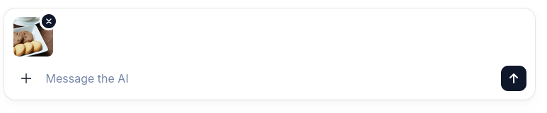

+++
title = "ChatKitでファイルアップロード機能を実装する"
date = "2025-12-06"

[taxonomies]
categories = ["Short Posts"]
tags = ["til", "ai-agents", "openai", "chatkit"]
+++

[前回](https://blog.mocobeta.dev/posts/20251205-files-api-agent/)はAgents SDKでファイルを解析するエージェントを作りました。ファイルを扱うにはやっぱりGUIがほしいので，ChatKitでファイルアップロードのインタフェースを実装してみます。

## ChatKitのUIにファイルアップロード機能をつける

ChatKitでの添付ファイルの取り扱い方法全般のドキュメントはこちら：
[Accept rich user input](https://openai.github.io/chatkit-python/guides/accept-rich-user-input/)

やることはけっこう多いのですが，とても雑に要約すると，

1. ChatKitのフロントエンドでファイルアップロードを有効にする。Direct uploadとTwo-phase uploadの2つの戦略がある。詳細は[こちら](https://openai.github.io/chatkit-python/guides/accept-rich-user-input/#configure-an-upload-strategy)。
2. バックエンドで添付ファイルのアップロード処理を実装する。Direct uploadとTwo-phase uploadで処理シーケンスが異なりますが，本質的にやることは同じ。
   1. 添付ファイルのコンテンツを受け取って，ファイルストレージに保存する
   2. 添付ファイルのメタデータ（`Attachment`オブジェクト）を作成してChatKitの`Store`に保存する
3. 添付ファイルの削除処理を実装する
   1. ファイルストレージからファイルのコンテンツを削除する
   2. ChatKitの`Store`からメタデータ（`Attachment`オブジェクト）を削除する
4. 添付ファイルをエージェントが利用できるようにResposes APIのインプットに変換する
5. 画像ファイルのプレビュー表示を実装する

という流れになります。

## とりあえず手を動かす

[ここ](https://blog.mocobeta.dev/posts/20251204-chatkit-ui/)で作ったチャットUIにファイルアップロード機能を追加していきます。

### フロントエンド

アップロード戦略にDirect uploadを使う場合，chatkitの初期化コードを2箇所変更します。

```javascript
const chatkit = useChatKit({
   api: { 
      url: CHATKIT_API_URL, 
      domainKey: CHATKIT_API_DOMAIN_KEY, 
      // Direct uploadを使う場合
      uploadStrategy: { "type": "direct", "uploadUrl": CHATKIT_API_URL + "/upload" } 
   },
   ...
   composer: {
     attachments: {
        // ファイルアップロードを有効にする
        enabled: true,
     }
   },
});
```

これで，チャットUIのメッセージ入力欄にファイルアップロードの「＋」ボタンが表示されるようになります。


### バックエンド

最低限必要なのは，

1. AttachmentStoreの実装
2. Storeの実装
2. アップロードエンドポイントの実装
3. ThreadItemConverterの実装

の4つです。

なお今回はDirect upload戦略を使うのですが，Two-phase upload戦略の実装例は `agent-framework` リポジトリの [python/samples/demos/chatkit-integration/attachment_store.py](https://github.com/microsoft/agent-framework/blob/8c6b12e6646e05be557750638ae893ac793ded18/python/samples/demos/chatkit-integration/attachment_store.py)と[python/samples/demos/chatkit-integration/store.py](https://github.com/microsoft/agent-framework/blob/8c6b12e6646e05be557750638ae893ac793ded18/python/samples/demos/chatkit-integration/store.py)と[python/samples/demos/chatkit-integration/app.py](https://github.com/microsoft/agent-framework/blob/8c6b12e6646e05be557750638ae893ac793ded18/python/samples/demos/chatkit-integration/app.py)が参考になると思います。

**AttachmentStoreの実装**

[`AttachmentStore`](https://openai.github.io/chatkit-python/api/chatkit/store/) を継承したクラスを作ります。`AttachmentStore`は添付ファイルのコンテンツを扱うクラスです。

以下はOpenAI Filesにファイルコンテンツをアップロードする例ですが，ストレージはもちろんローカルストレージでもS3のようなオブジェクトストレージでも何でもOKです。

```python
# file_attachment_store.py
class FileAttachmentStore(AttachmentStore[dict[str, Any]]):
    
    def __init__(self, openai_client: AsyncOpenAI, store: MemoryStore) -> None:
        self._openai_client = openai_client
        self._store = store
    
    @override
    async def delete_attachment(self, attachment_id: str, context: dict[str, Any]) -> None:
        """添付ファイルのコンテンツとメタデータを削除する。"""
        # 基底クラスのAtachmentStoreでabstractmethodなので，オーバーライドする
        try:
            # OpenAI Filesからファイルを削除する
            result = await self._openai_client.files.delete(file_id=attachment_id)
            if not result.deleted:
                raise Exception(f"Failed to delete file {attachment_id}")
            logger.info(f"Deleted file {attachment_id}.")
            # メタデータも削除する
            await self._store.delete_attachment(attachment_id, context)
        except NotFoundError:
            pass
    
    async def upload_to_openai(self, data: BinaryIO, filename: str, content_type: str) -> FileObject:
        """OpenAI Filesにファイルをアップロードする"""
        try:
            response = await self._openai_client.files.create(
                # fileパラメータにはdataだけでなくfilename, data, content_typeの３つ組を渡す
                # Responses APIで使うために，content typeを必ず指定しておく
                # content typeを指定しておかないと，Responses APIでエラーになる
                file=(filename, data, content_type),
                purpose="user_data",
            )
            file_id = response.id
            logger.info(f"Uploaded file {response.filename} with id {file_id}")
            return response
        except Exception as e:
            logger.error(f"Failed to upload file: {e}")
            raise
```

**Storeの実装**

`Store`（を継承したクラス）に，添付ファイルのメタデータを保存・取得・削除するメソッドを追加実装します。インメモリストアなのであれですが，雰囲気は伝わると思います。

```python
# memory_store.py
class MemoryStore(Store[dict[str, Any]]):
   """Simple in-memory store compatible with the ChatKit Store interface."""

   def __init__(self) -> None:
        self._threads: Dict[str, _ThreadState] = {}
        self._attachments: Dict[str, Attachment] = {} # 添付ファイルのメタデータを保存する辞書
   
   # 省略。実装は以下参照。
   # https://github.com/openai/openai-chatkit-advanced-samples/blob/main/examples/cat-lounge/backend/app/memory_store.py

    async def save_attachment(
        self,
        attachment: Attachment,
        context: dict[str, Any],
    ) -> None:
        # Do not use in production.
        self._attachments[attachment.id] = attachment.model_copy(deep=True)

    async def load_attachment(
        self,
        attachment_id: str,
        context: dict[str, Any],
    ) -> Attachment:
        # Do not use in production.
        attachment = self._attachments.get(attachment_id)
        if attachment:
            return attachment.model_copy(deep=True)
        else:
            raise NotFoundError(f"Attachment {attachment_id} not found")

    async def delete_attachment(self, attachment_id: str, context: dict[str, Any]) -> None:
        # Do not use in production.
        self._attachments.pop(attachment_id, None)
```

**アップロードエンドポイントの実装**

Direct uploadのアップロードエンドポイントのパスは，フロントエンドで指定した `uploadUrl` と一致させる必要があります。

```python
# main.py
...

@app.post("/chatkit/upload")
async def upload_file(request: Request):
    form_data = await request.form()
    file = form_data.get("file")

    if not isinstance(file, UploadFile):
        raise HTTPException(
            status_code=status.HTTP_400_BAD_REQUEST,
            detail="No file uploaded",
        )
    
    if not file.content_type:
        raise HTTPException(
            status_code=status.HTTP_400_BAD_REQUEST,
            detail="Uploaded file has no content type",
        )

    # ファイルコンテンツを保存（ここではOpenAI Filesにアップロード）
    try:
        response = await attachment_store.upload_to_openai(file.file, file.filename or "untitled", file.content_type)
        file_id = response.id
    except Exception as e:
        raise HTTPException(
            status_code=status.HTTP_500_INTERNAL_SERVER_ERROR,
            detail=f"Failed to upload file: {str(e)}",
        )

    # 添付ファイルのメタデータを作成
    if file.content_type.startswith("image/"):
        attachment = ImageAttachment(
            id=file_id,
            name=file.filename or "untitled",
            mime_type=file.content_type,
            preview_url=AnyUrl(f"https://{request.url.hostname}/files/{file_id}/preview"),
        )
    else:
        attachment = FileAttachment(
            id=file_id,
            name=file.filename or "untitled",
            mime_type=file.content_type,
        )
    
    # メタデータをStoreに保存
    await store.save_attachment(attachment, {"request": request})
    logger.info(f"Saved attachment metadata for file {file.filename} with id {file_id}")

    data = attachment.model_dump(mode="json")
    return JSONResponse(content=data)
```

エラーハンドリングやトランザクションどうするんだ，などいろいろ気になることはありますが，デモなのでテクニカルな詳細には目をつぶっておきます。

## 動作確認

ここまでで，ファイルアップロードと削除が動作するようになるので，起動して確認してみます。

```bash
# フロントエンド
npm run dev

# バックエンド
export OPENAI_API_KEY="sk-..."
python -m uvicorn app.main:app --reload --port 8000
```

ファイルをアップロードしたところ。



アップロード成功時のサーバーのログ

```bash
INFO:httpx:HTTP Request: POST https://api.openai.com/v1/files "HTTP/1.1 200 OK"
INFO:app.file_attachment_store:Uploaded file 20 with id file-RPgCtHqCfUsbiaZHfKcb1z
INFO:app.main:Saved attachment metadata for file cookies2.jpg with id file-RPgCtHqCfUsbiaZHfKcb1z
INFO:     127.0.0.1:41542 - "POST /chatkit/upload HTTP/1.1" 200 OK
```

画像の右上に小さく出ている「✘」を押すと削除されます。

ファイル削除成功時のサーバーのログ

```bash
INFO:chatkit:Received request op: attachments.delete
INFO:httpx:HTTP Request: DELETE https://api.openai.com/v1/files/file-RPgCtHqCfUsbiaZHfKcb1z "HTTP/1.1 200 OK"
INFO:app.file_attachment_store:Deleted file file-RPgCtHqCfUsbiaZHfKcb1z.
INFO:     127.0.0.1:41552 - "POST /chatkit HTTP/1.1" 200 OK
```

ここまででやっと，ChatKitでのファイルアップロードと削除が動作するようになりました！

これで終わりではなく，アップロードしたファイルをエージェントが解釈可能な入力にするためには，もう一手間が必要です。長くなったので続きはまたあした。

----

これは [Agents SDK+αのTipsを一人で書いていくアドカレ Advent Calendar 2025](https://adventar.org/calendars/12523)の6日目の記事です。