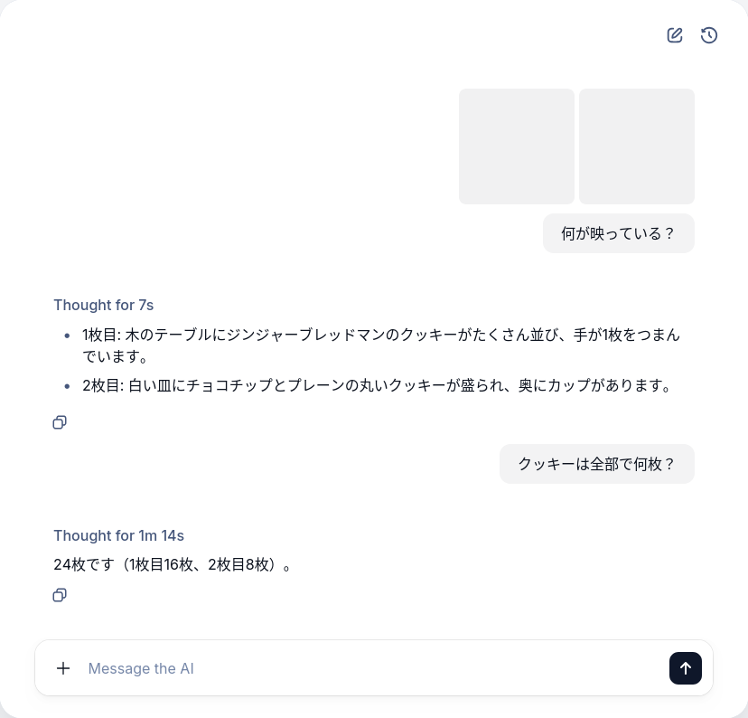

+++
title = "ChatKitで添付ファイルをエージェントに渡して解析させる"
date = "2025-12-07"

[taxonomies]
categories = ["Short Posts"]
tags = ["til", "agents", "openai", "chatkit"]
+++

昨日のエントリ『[ChatKitでファイルアップロード機能を実装する](https://blog.mocobeta.dev/posts/202512006-file-upload-chatkit/)』では，ChatKitのチャットUIにファイルアップロード機能を追加しました。今回は，アップロードされた添付ファイルをエージェントが使うコンテキストとして利用できるように，添付ファイルをLLMへの入力に変換します。

ドキュメントはこちら：
[Convert attachments to model input](https://openai.github.io/chatkit-python/guides/accept-rich-user-input/#convert-attachments-to-model-input)

## OpenAI Files経由でエージェントに添付ファイルを渡すときの注意

OpenAI FilesとChatKitを併用する時にハマった点です。

Files APIへのファイルアップロード（create）時に，`file`パラメータにはデータ本体だけでなく，コンテンツタイプ（MIMEタイプ）も含めておきましょう。コンテンツタイプを含めておかないと，ファイル利用時，つまりエージェントに読ませようとしたタイミングで `BadRequestError` が発生します。エラーの原因がわかれば，それはそう...なのですが，特に注記もなくデバッグに時間がかかったので紹介しておきます。

```python
# これはOK
response = await self._openai_client.files.create(
    file=(filename, data, content_type),
    purpose="user_data",
)
```

```python
# これはNG
# ファイルアップロードは成功するけど，Responses APIで利用するときに「サポートしていないフォーマットです」というエラーになる
response = await self._openai_client.files.create(
    file=data
    purpose="user_data",
)
```

## 添付ファイルをエージェントに渡す

`ThreadItemConverter`を継承したクラスを作成して，`attachment_to_message_content`というメソッドを実装します。

LLMにファイルを与えるメッセージの作り方は，[エージェントで画像やPDFファイルを解析する - Files APIとAgents SDKとResponses API](https://blog.mocobeta.dev/posts/20251205-files-api-agent/)とほぼ同じです。

```python
class FileAttachmentConverter(ThreadItemConverter):

    @override
    async def attachment_to_message_content(
        self, attachment: Attachment
    ) -> ResponseInputContentParam:
        """添付ファイルをエージェント(LLM)への入力メッセージに変換する"""
        # 基底クラスのThreadItemConverterでは未実装なので，必ずオーバーライドが必要

        if isinstance(attachment, ImageAttachment):
            # 画像添付ファイルの場合
            # 戻り値の型はTypedDictで定義されているので，ソースコードとResponses APIのリファレンスを参照のこと
            return ResponseInputImageParam(
                type="input_image",
                file_id=attachment.id,  # OpenAI FilesのファイルID
                detail="auto",
            )
        elif isinstance(attachment, FileAttachment):
            # その他のファイルの場合
            return ResponseInputFileParam(
                type="input_file",
                file_id=attachment.id,  # OpenAI FilesのファイルID
            )
        else:
            # should not happen
            raise ValueError(f"Unsupported attachment type: {type(attachment)}")
```

あとは，作成したクラスを`ChatKitServer`の初期化時に渡します。

```python
class MyChatKitServer(ChatKitServer[dict[str, Any]]):
    """ChatKit server wired up with the virtual cat caretaker."""

    def __init__(self, store: MemoryStore, attachment_store: FileAttachmentStore, thread_item_converter: ThreadItemConverter) -> None:
        self.store = store
        super().__init__(self.store, attachment_store)
        self.thread_item_converter = thread_item_converter  # カスタムThredItemConverterをセット
...
```

## ChatKitで画像ファイルをアップロードして解析できるようになった

フロントエンドとバックエンドを起動。

```bash
# フロントエンド
npm run dev

# バックエンド
export OPENAI_API_KEY="sk-..."
python -m uvicorn app.main:app --reload --port 8000
```

cookies1.jpg


cookies2.jpg


2つ画像をUIから上げて，画像について質問します。手抜きをしていてプレビュー機能を実装していないので，画像のサムネイルが表示されていません。




モデルは`gpt-5`を使っています。1枚目の画像は簡単そうですが，どう見ても15枚なので数え間違いをしている。2枚目も間違っていると思う（7枚か9枚ならわかる）けど，これはなんで8枚と認識したんだろう？最新のモデルでも，画像と計算を組み合わせたタスクは簡単ではないようです。

----

これは [Agents SDK+αのTipsを一人で書いていくアドカレ Advent Calendar 2025](https://adventar.org/calendars/12523)の7日目の記事です。