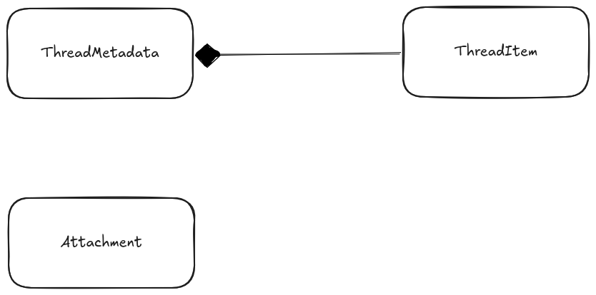

+++
title = "ChatKitの会話履歴の構造"
date = "2025-12-08"

[taxonomies]
categories = ["Short Posts"]
tags = ["til", "ai-agents", "openai", "chatkit"]
+++

ChatKitでは，会話履歴を`Thread`という単位で管理しています。（ややこしいですが，[以前のエントリ](https://blog.mocobeta.dev/posts/20251203-agents-memory/)で少し触れたAgents SDKの`Session`とは別物です。）

ChatKitを使いこなすには，この`Thread`のデータ構造と，また`Thread`の管理を担う`Store`を理解することが一番大事といってもよいと思います。

ドキュメントはこちら：
[Threads and items](https://openai.github.io/chatkit-python/concepts/threads/)

## 主要なデータ構造

会話履歴に登場する主要なデータタイプは，`ThreadMetadata`, `ThreadItem`, `Attachment`の３つだけです。

`ThreadMetadata`が一つの会話を表し，`ThreadItem`が会話の中の一つ一つの発話やアクションを表します。`ThreadItem`はユーザーの発話，アシスタントの応答の他，内部で行われるツール実行など，会話の中で発生するありとあらゆるアクションを表します（そのため実態はUnion typeになっている）。また，`Attachment`が添付ファイルを表します。

ものすごく雑なクラス図を書くとこう。

また，これらを保存・管理するリポジトリに相当するクラスが`Store`です。

`Attachment` が `ThreadMetadata` とが関連づけられていないように見えますが，実際直接は関連づけられていなくて，`ThreadMetadata`の中のひとつの`ThreadItem`を介して関連づける形になっています。認識が間違っていなければ，[昨日のエントリ](https://blog.mocobeta.dev/posts/20251207-file-attachment-chatkit/)で触れた`ThreadItemConverter`が，`Attachment`から新しい`ThreadItem`を作るという処理をしている，はず。

## `Thread`の永続化について

RDBMSかドキュメントデータベースのいずれもストレージに使えそうです。

[ChatKitのexampleリポジトリ](https://github.com/openai/openai-chatkit-advanced-samples)には，`MemoryStore`（インメモリストア）しか実装例がないのですが，Microsoft謹製の`agent-framework`というリポジトリに，SQLiteをバックエンドにした簡易な`Store`の実装があります。RDBのテーブル設計はこちらを起点にすると良さそう。

[python/samples/demos/chatkit-integration/store.py](https://github.com/microsoft/agent-framework/blob/551219cb559387164d0fbad99d8ebe7664e77471/python/samples/demos/chatkit-integration/store.py)

----

これは [Agents SDK+αのTipsを一人で書いていくアドカレ Advent Calendar 2025](https://adventar.org/calendars/12523)の8日目の記事です。