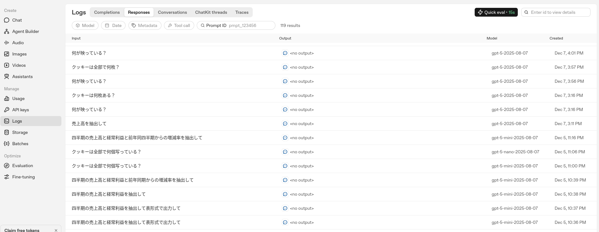
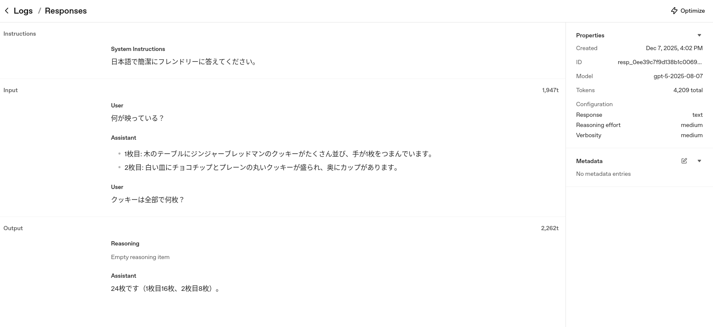

+++
title = "OpenAI Logsを触る"
date = "2025-12-10"

[taxonomies]
categories = ["Short Posts"]
tags = ["til", "ai-agents", "openai"]
+++

Responses APIなど，OpenAI LLM APIに送信したリクエスト（プロンプト）と，レスポンスのログは，OpenAIのダッシュボードのLogsセクションから確認できます。

[Logs - OpenAI API](https://platform.openai.com/logs) (要ログイン)

Response APIのログ

ログをクリックするとAPIリクエストの詳細（システムプロンプト，ユーザーインプット，LLMアウトプット，使用モデル，リクエストパラメータ，トークン数など）が確認できます。

商用環境においては機密情報に十分注意が必要ですが，ダッシュボードUIからログがさっと一覧できるのは助かる。ユーザーインプットはテキストのみで，アップロードしたファイルの中身までは見られないようです。

AIエージェントの開発・デバッグの観点では，[handoffs](https://openai.github.io/openai-agents-python/handoffs/)等のエージェントの取ったアクションを階層的に表示してくれるLogs > Tracesが特に便利そうです。Tracesはまだあまり使えていないので，別の機会に調べたい。

----

これは [Agents SDK+αのTipsを一人で書いていくアドカレ Advent Calendar 2025](https://adventar.org/calendars/12523)の10日目の記事です。