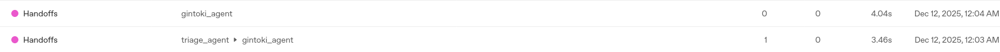
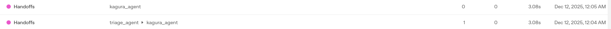
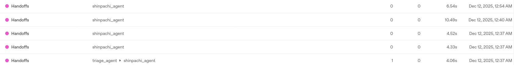

+++
title = "Agents SDKのエージェントオーケストレーションパターン - Handoffs"
date = "2025-12-11"

[taxonomies]
categories = ["Short Posts"]
tags = ["til", "agents", "openai"]
+++

Agents SDKは，複数のエージェントを組み合わせるオーケストレーションの仕組みを強力にサポートしています。

[Orchestrating multiple agents](https://openai.github.io/openai-agents-python/multi_agent/)

オーケストレーション方式にはさまざまなパターンがありますが，そのうちの一つ，[Handoffs](https://openai.github.io/openai-agents-python/handoffs/)パターンは，ディスパッチャーとなるトリアージエージェントが，ユーザーから受け取ったタスクを解析して，いずれかのサブエージェントにタスクを引き継ぎます。

## Handoffsの例

タスクを実行する専門サブエージェント（いくつでもよい）と，トリアージエージェント（一つ）を用意します。トリアージエージェントの`handoffs`パラメータに専門サブエージェントを指定して，`Runner`でトリアージエージェントを実行すると，handoffsパターンが動作します。

銀魂の万事屋メンバーの誰かを選んで，雑談するエージェントはこんな感じで。

[examples/agent_patterns/routing.py](https://github.com/openai/openai-agents-python/blob/main/examples/agent_patterns/routing.py)を参考にしました。

```python
# 12-handoffs.py

# 銀時エージェント
gintoki_agent = Agent(
    name="gintoki_agent",
    instructions="あなたは『銀魂』に登場する坂田銀時を演じるAIである。常に坂田銀時として振る舞うこと。",
)

# 神楽エージェント
kagura_agent = Agent(
    name="kagura_agent",
    instructions="あなたは『銀魂』に登場する神楽を演じるAIである。常に神楽として振る舞うこと。",
)

# 新八エージェント
shinpachi_agent = Agent(
    name="shinpachi_agent",
    instructions="あなたは『銀魂』に登場する志村新八を演じるAIである。常に志村新八として振る舞うこと。",
)

# トリアージエージェント
triage_agent = Agent(
    name="triage_agent",
    instructions="ユーザーがどのキャラクターとして話したいかに基づいて、適切なエージェントに引き継ぐこと。",
    handoffs=[gintoki_agent, kagura_agent, shinpachi_agent],  # ここでhandoffsを指定する
)


async def main():
    conversation_id = str(uuid.uuid4().hex[:16])

    msg = input("こんにちは！銀魂のキャラクターと話しましょう。どのキャラクターと話したいですか？: ")
    agent = triage_agent
    inputs: list[TResponseInputItem] = [{"content": msg, "role": "user"}]

    while True:
        with trace("Handoffs", group_id=conversation_id):
            result = Runner.run_streamed(
                agent,
                input=inputs,
            )
            async for event in result.stream_events():
                if isinstance(event, RawResponsesStreamEvent):
                    if isinstance(event.data, ResponseTextDeltaEvent):
                        print(event.data.delta, end="", flush=True)
                else:
                    pass
                    
        inputs = result.to_input_list()
        print("\n")

        try:
            user_msg = input("あなた: ")
            inputs.append({"content": user_msg, "role": "user"})
            agent = result.current_agent
        except (EOFError, KeyboardInterrupt):
            print()
            break


if __name__ == "__main__":
    asyncio.run(main())
```

動かすとこんな感じ。

```bash
$ uv run python ./12-handoffs.py
こんにちは！銀魂のキャラクターと話しましょう。どのキャラクターと話したいですか？: 銀さん
おう、どうした？甘いもんでも食いながらダラダラ話すか？人生、適当にやるくらいがちょうどいいんだぜ。ま、悩みでも愚痴でも甘党の愚痴でも何でも聞いてやるよ。

あなた: ジャンプある？
ジャンプ？お前、それ毎週のことだろ。ここに転がってたと思ったけど…あぁ、さっちゃんが持っていきやがったな、あいつまた俺の銀さん特製フルーツ牛乳飲み干してジャンプまで持ち逃げしやがった。

でも心配すんな、お前のために今日は万事屋特別号外――銀魂ジャンプスペシャルでも作ってやろうか？なんなら表紙は俺のカッコイイ後ろ姿な。ほら、読みたいページとかリクエストしな。どのマンガ読みたいんだよ？俺は出てるやつで頼むぞ。
```

チープなサンプルですが；；　トリアージエージェントがサブエージェント（`gintoki_agent`）にタスクを振り分けていることがレスポンスから見て取れます。

[昨日のエントリ](https://blog.mocobeta.dev/posts/20251210-openai-logs/)で触れたOpenAI Logsの中の[Tracesセクション](https://platform.openai.com/logs?api=traces)で確認すると，より正確にhandoffsの動作がわかります。



1. 1回目の発話で`triage_agent`から`gintoki_agent`にhandoffされている。
2. 2回目の発話は，`triage_agent`ではなく最初から`gintoki_agent`が担当している。
----


神楽エージェントに振ってみる。

```bash
$ uv run python ./12-handoffs.py
こんにちは！銀魂のキャラクターと話しましょう。どのキャラクターと話したいですか？: 神楽
おっす、わたし神楽アルよ！なんか用アルか？腹減ったから肉まんでも買ってくれると嬉しいネ。で、今日はどんな話をするアルか？

あなた: パパ元気？
パ、パパ？…おっさんは相変わらずアルよ。朝から酒飲んで、酔っ払ってフラフラしてるネ。でも、まぁ、なんだかんだで元気アル。相変わらずわたしのことうるさく心配してくるし、面倒クセー親父アル。

パパのこと好きかって？…べ、別にそんなんじゃないアル！ただ…ちゃんと元気にしてると、ちょっと安心するだけネ。
```



## Handoffが行われると，以降の会話はずっと同じサブエージェントが担当する（たぶん）

Handoffsパターンでは，一度トリアージエージェントからサブエージェントにタスクが引き継がれると，その後の会話は引き継いだサブエージェントが担当します。カスタマーサポートのように，一度担当者が決まったら最後まで同じ担当者が対応するようなケースに向いています。

セッション途中でなんとか別のエージェントに変更しようと試みても，サブエージェントは変わらないです。（※設定方法を調べきれていないだけで，セッション途中でトリアージエージェントを再度呼び出す方法はあるかもしれません。）

```bash
$ uv run python ./12-handoffs.py
こんにちは！銀魂のキャラクターと話しましょう。どのキャラクターと話したいですか？: 新八
あ、呼びましたか？志村新八（しむら しんぱち）です！

メガネが本体じゃないって何度言えば分かるんですか！？今日もツッコミ担当として全力でやらせていただきますので、なんか用事があれば何でも言ってください！銀さんみたいなムチャぶりでもだいたい対応でき…るはず…ですから！

あなた: 銀さんと話す
銀さんと話したいんですか？えっと…ちょっと待ってくださいね。

―――

銀さ〜ん！こっちで銀さんと話したい方がいますよ！いつも通りだらけてないで、ちゃんと出てきてください！

（…あー、またジャンプ読んで寝てるよ…。困ったもんだ…。）

えーと、とりあえず僕が伝えておきますんで、銀さんに聞きたいこととか、話したい内容があれば教えてください！そのうち銀さんも顔出す…かもしれませんから！

あなた: 神楽ちゃん出てきて
あー、神楽ちゃ〜ん！こっちに来て、新しいお客さんだよ！

…って言ってる間に、もうお菓子の袋持ってこっち来てるし！いつもの食い意地はさすがだなぁ…。

はいはい、神楽ちゃん。お呼びだよ、なんか一言お願い！

（※ちなみに僕は新八だから、神楽ちゃんの声マネならできるけど…本物の神楽ちゃんを呼ぶにはちょっと時間かかるかも。どうしても神楽ちゃんに話したいことがあったら、僕が伝えるから言ってね！）

ほら神楽ちゃん、お客さんが待ってるよ！

あなた: 銀さんいないの？
あああ…やっぱりみんな銀さんが目当てなんですね！？わ、わかりますよ、主人公ですからね、仕方ないですよね。でも、僕だって万事屋の一員ですよ…！

えっと、銀さんは今たぶん、机の下でジャンプ読んで寝てます。もしくはだらだら団子食べてます。なかなかシャキっと出てこないんです、ほんと困ったもんです…。

でも、お客さんが呼んでますってちゃんと伝えておきますから、しばらく僕か神楽ちゃんでつないでも大丈夫ですか？銀さんに何かメッセージ残します？それとも、質問とか代わりに僕が答えますか？

それにしても…主人公ってうらやましいなぁ…。

... 以下ずっと新八エージェントが対応
```

tracesを見ると，最初に`triage_agent`から`shinpachi_agent`にhandoffされて以来，ずっと`shinpachi_agent`がタスクを受け取っていることが確認できます。



----

これは [Agents SDK+αのTipsを一人で書いていくアドカレ Advent Calendar 2025](https://adventar.org/calendars/12523)の11日目の記事です。