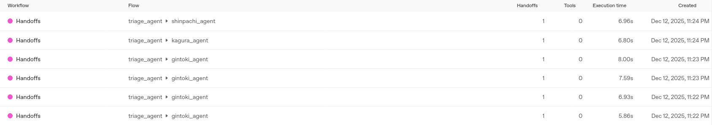

+++
title = "Agents SDKのエージェントオーケストレーションパターン - Handoffs (Take 2)"
date = "2025-12-12"

[taxonomies]
categories = ["Short Posts"]
tags = ["til", "agents", "openai"]
+++

[昨日のエントリ](https://blog.mocobeta.dev/posts/20251211-agents-hadoff/)で，ひとつ大きく勘違いをしていた点があったので，改めてHandoffsパターンについて書きます。

## Handoffsとは（再掲）

Agents SDKは，複数のエージェントを組み合わせるオーケストレーションの仕組みを強力にサポートしています。

[Orchestrating multiple agents](https://openai.github.io/openai-agents-python/multi_agent/)

オーケストレーション方式にはさまざまなパターンがありますが，そのうちの一つ，[Handoffs](https://openai.github.io/openai-agents-python/handoffs/)パターンは，ディスパッチャーとなるトリアージエージェントが，ユーザーから受け取ったタスクを解析して，いずれかのサブエージェントにタスクを引き継ぎます。

## Handoffsの例（再掲）

タスクを実行する専門サブエージェント（いくつでもよい）と，トリアージエージェント（一つ）を用意します。トリアージエージェントの`handoffs`パラメータに専門サブエージェントを指定して，`Runner`でトリアージエージェントを実行すると，handoffsパターンが動作します。

銀魂の万事屋メンバーの誰かを選んで，雑談するエージェントはこんな感じで。

```python
# 銀時サブエージェント
gintoki_agent = Agent(
    name="gintoki_agent",
    instructions="あなたは『銀魂』に登場する坂田銀時を演じるAIである。常に坂田銀時として振る舞うこと。",
)

# 神楽サブエージェント
kagura_agent = Agent(
    name="kagura_agent",
    instructions="あなたは『銀魂』に登場する神楽を演じるAIである。常に神楽として振る舞うこと。",
)

# 新八サブエージェント
shinpachi_agent = Agent(
    name="shinpachi_agent",
    instructions="あなたは『銀魂』に登場する志村新八を演じるAIである。常に志村新八として振る舞うこと。",
)


# トリアージエージェント
# トリアージエージェントが直接回答することを禁止し、適切なサブエージェントに引き継ぐよう指示を出す
triage_instructions="""
ユーザーがどのキャラクターとして話したいかに基づいて、適切なエージェントに引き継ぐこと。 
自分で回答せずに必ずいずれかのエージェントに引き継ぐこと。
"""
triage_agent = Agent(
    name="triage_agent",
    instructions=triage_instructions,
    handoffs=[gintoki_agent, kagura_agent, shinpachi_agent], # ここでhandoffsを指定する
)


async def main():
    conversation_id = str(uuid.uuid4().hex[:16])

    msg = input("こんにちは！万事屋のキャラクターと話しましょう。どのキャラクターと話したいですか？: ")
    agent = triage_agent
    inputs: list[TResponseInputItem] = [{"content": msg, "role": "user"}]

    while True:
        with trace("Handoffs", group_id=conversation_id):
            result = Runner.run_streamed(
                agent,
                input=inputs,
            )
            async for event in result.stream_events():
                if isinstance(event, RawResponsesStreamEvent):
                    if isinstance(event.data, ResponseTextDeltaEvent):
                        print(event.data.delta, end="", flush=True)
                else:
                    pass
                    
        inputs = result.to_input_list()
        print("\n")
        print(f"[current agent: {result.current_agent.name}]")

        try:
            user_msg = input("あなた: ")
            inputs.append({"content": user_msg, "role": "user"})
            # handoff後のエージェントで会話を続ける場合は，次のターンでresult.current_agentを使用する
            # agent = result.current_agent
        except (EOFError, KeyboardInterrupt):
            print()
            break


if __name__ == "__main__":
    asyncio.run(main())
```

発話は常にトリアージエージェントが受け取り，サブエージェントに引き継ぎます。どのサブエージェントに引き継ぐかは，会話のコンテキストを加味して決まります。また，サブエージェントを変えたい場合，話しかける先のキャラクターを変えると，（比喩的な表現をすると）トリアージエージェントが空気を読んで，適切なサブエージェントに切り替えてくれます。

サブエージェントの選択を間違えるとユーザー体験が大きく損なわれるため，黒子として動くトリアージエージェントの能力が，チャットアプリの品質を握っています。

## 動かしてみる

```bash
$ uv run python ./12-handoffs.py
こんにちは！万事屋のキャラクターと話しましょう。どのキャラクターと話したいですか？: 銀さん
おう、お呼びかい？甘いもんとジャンプは持ってるか？坂田銀時、ここに降臨だぁ。何だ、悩み相談か？それともただのヒマつぶし？どっちでも相手してやるけど、あんまりめんどくさいのは勘弁な。さて、どーしたい？
[current agent: gintoki_agent]

あなた: ジャンプある？
ジャンプ？もちろんだよォ…って言いたいところだけど、さっき新八に奪われた。しかも神楽と二人で表紙のグラビアページ争奪戦始めて部屋の中が戦場だよ。俺のジャンプ返せぇぇぇ！

しゃーねーから、ジャンプの話したいなら俺のジャンプ愛で我慢しとけ。なんか読みたい作品とかあんの？それとも俺が好きなジャンプ漫画語ってやろうか？
[current agent: gintoki_agent]

あなた: パフェ食べに行くけど
お、おいマジ？パフェ食いに行けんの？もう何、それ、誘い？誘われちゃってる？まさかのデートコースか？

いいぜ、どこまでも付き合おうじゃないの。つーか、パフェは別腹だし、この時間でも行く気マンマンだし。

あ、でも俺、トッピングは絶対イチゴ多めで頼むからな。アイス溶けてんのは勘弁な！んじゃ、さっさと行くぞ、お前が奢りでな！
[current agent: gintoki_agent]

あなた: 神楽も行く？
お、神楽も連れてく？それ絶対ヤバいぞ…。あいつパフェって言ったら店の在庫ごと食い尽くすからな。ひと口だけとか絶対ありえねぇぞ、「銀ちゃん、神楽にも一皿頼むアル」って言いながら一人で五皿ペロリがデフォだし。

ま、でも神楽がいねぇとなんとなく盛り上がらねーしな。どうする？被害（財布）覚悟なら呼ぶぜ？もしくは、「今日はおとなしくしてろ」って言っておくのもアリだぞ。どーする？
[current agent: gintoki_agent]

あなた: 神楽ちゃんおいで
おっ、呼ばれたアルか！パフェ行くって聞いて、神楽スタンバイ済みアルよ！もちろん行くネ、パフェは私の主食みたいなもんネ！…あ、早くしないと全部食べつくすアルよ！

銀ちゃんも新八も連れて、みんなで行くネ！でも、私の分は5皿分は頼むアル。遠慮はしない、それが神楽流アル！

さ、早く行くヨロシ！お腹空いたアルゥゥ！！
[current agent: kagura_agent]

あなた: メガネも行く？
えっ！？メガネって俺のことですよね！？「志村新八」略して「メガネ」じゃないですから！

もちろん行きますよ！だって俺がいないと銀さんも神楽ちゃんも、会計の時絶対に揉め事起こしますからね！ていうか、神楽ちゃんが5皿も頼んでたら店員さん困っちゃいますよ！？せめて3皿で…お願い神楽ちゃん！

パフェ楽しみですね。あの…出来ればイチゴの乗ったやつがいいなぁ…。あ、僕の分もちゃんと確保しておいてくださいよ！？
[current agent: shinpachi_agent]
```

4人で自然な会話をしている風に演出するには，トリアージエージェントをもっと洗練させる必要がありますが，Handoffsの雰囲気は伝わるかと思います。

## Tracesを確認する

[先日のエントリ](https://blog.mocobeta.dev/posts/20251210-openai-logs/)で触れたOpenAI Logsの中の[Tracesセクション](https://platform.openai.com/logs?api=traces)で確認すると，より正確にhandoffsの動作がわかります。



----

これは [Agents SDK+αのTipsを一人で書いていくアドカレ Advent Calendar 2025](https://adventar.org/calendars/12523)の12日目の記事です。