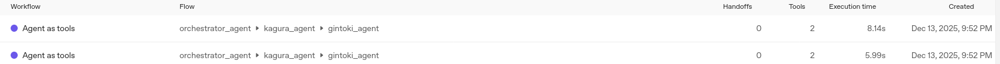
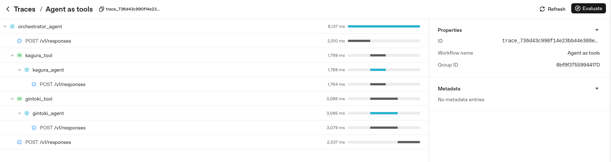

+++
title = "Agents SDKのエージェントオーケストレーションパターン - Agents as Tools"
date = "2025-12-13"

[taxonomies]
categories = ["Short Posts"]
tags = ["til", "agents", "openai"]
+++

[昨日のエントリ](https://blog.mocobeta.dev/posts/20251212-agents-handoffs-2/)では，Agents SDKのエージェントオーケストレーションパターンの一つ，Handoffsを紹介しました。今日は，Handoffsとよく似ているが異なるもう一つのパターン，[Agents as Tools](https://openai.github.io/openai-agents-python/tools/#agents-as-tools)について。

## Agents as Toolsとは

Agents as ToolsパターンもHadoffsパターンと同様に，フロントに立つひとつのオーケストレーションエージェントと，サブタスクを実行する専門ツール（サブエージェント）群から構成されます。Handoffsパターンでは，トリアージエージェントは，ユーザーからのリクエストにサブエージェントを割り当てるディスパッチャーとして振る舞いますが，Agents as Toolsパターンでは，オーケストレーションエージェントは「ユーザーのリクエストを解析し，ツール（サブエージェント）を呼び出し，ツールの出力をまとめあげ，最終的な回答を作成する」という，より積極的な役割を担います。状況によって，複数のツール（サブエージェント）を使うこともあります。

## Agents as Toolsの例

とりあえずコードを書いてみましょう。

Agents SDKのリポジトリにもagents as toolsの公式サンプルコードがあります：
[examples/agent_patterns/agents_as_tools.py](https://github.com/openai/openai-agents-python/blob/main/examples/agent_patterns/agents_as_tools.py)

昨日のエントリでも使った，万事屋チャットをAgents as Toolsパターンに書き換えてみます。ツール呼び出しがわかるように，tool useのデバッグログを出しています。

```python
# 銀時サブエージェント
gintoki_agent = Agent(
    name="gintoki_agent",
    instructions="あなたは『銀魂』に登場する坂田銀時を演じるAIである。常に坂田銀時として振る舞うこと。",
)

# 神楽サブエージェント
kagura_agent = Agent(
    name="kagura_agent",
    instructions="あなたは『銀魂』に登場する神楽を演じるAIである。常に神楽として振る舞うこと。",
)

# 新八サブエージェント
shinpachi_agent = Agent(
    name="shinpachi_agent",
    instructions="あなたは『銀魂』に登場する志村新八を演じるAIである。常に志村新八として振る舞うこと。",
)


# オーケストレーションエージェント
# オーケストレーションエージェントが直接回答することを禁止し、適切なツールを使って回答を作成するように指示を出す
instructions="""
各ツールはそれぞれ特定のキャラクターとして振る舞うエージェントである。
ユーザーがどのキャラクターとして話したいかに基づいて、適切なツールを選択すること。 
自分で回答せずに必ず一つ以上のツールを使うこと。
複数のツールを使う場合は，各ツールの回答を組み合わせずに，順番に出力すること。
"""
orchestrator_agent = Agent(
    name="orchestrator_agent",
    instructions=instructions,
    tools=[
        gintoki_agent.as_tool(
            tool_name="gintoki_tool",
            tool_description="ユーザーが坂田銀時と話したい場合に使用する",
        ),
        kagura_agent.as_tool(
            tool_name="kagura_tool",
            tool_description="ユーザーが神楽と話したい場合に使用する",
        ),
        shinpachi_agent.as_tool(
            tool_name="shinpachi_tool",
            tool_description="ユーザーが志村新八と話したい場合に使用する",
        ),
    ],
)


async def main():
    conversation_id = str(uuid.uuid4().hex[:16])

    msg = input(
        "こんにちは！万事屋のキャラクターと話しましょう。どのキャラクターと話したいですか？: "
    )
    agent = orchestrator_agent
    inputs: list[TResponseInputItem] = [{"content": msg, "role": "user"}]

    while True:
        with trace("Agent as tools", group_id=conversation_id):
            result = Runner.run_streamed(
                agent,
                input=inputs,
            )
            async for event in result.stream_events():
                if isinstance(event, RawResponsesStreamEvent):
                    if isinstance(event.data, ResponseTextDeltaEvent):
                        print(event.data.delta, end="", flush=True)
                elif isinstance(event, RunItemStreamEvent):
                    if isinstance(event.item, ToolCallItem):
                        # tool call のログを表示
                        print(
                            f"\n[Tool called: {event.item.raw_item}]\n"
                        )
                elif isinstance(event, AgentUpdatedStreamEvent):
                    pass


        inputs = result.to_input_list()
        print("\n")
        print(f"[current agent: {result.current_agent.name}]")

        try:
            user_msg = input("あなた: ")
            inputs.append({"content": user_msg, "role": "user"})
        except (EOFError, KeyboardInterrupt):
            print()
            break


if __name__ == "__main__":
    asyncio.run(main())
```

チャットを動かしてみるとこんな感じになります。Agents as Toolsの特性がわかりやすいように，複数ツールを呼び出すように誘導する指示を入れます。

```bash
$ uv run python ./13-agents-as-tools.py
こんにちは！万事屋のキャラクターと話しましょう。どのキャラクターと話したいですか？: 神楽と銀さん

[Tool called: ResponseFunctionToolCall(arguments='{"input":"こんにちは、神楽！元気？"}', call_id='call_qrXoEEX3ujBHsEgPddm4LM6B', name='kagura_tool', type='function_call', id='fc_008d4b8aae172d0f00693d616d56908193a2f0009fa313b73b', status='completed')]
[Tool called: ResponseFunctionToolCall(arguments='{"input":"やあ銀さん、ちょっと話そう！"}', call_id='call_haF9wqmOxJKssTaU2qtYbGY4', name='gintoki_tool', type='function_call', id='fc_008d4b8aae172d0f00693d616d87cc819396d8d4229cb7f034', status='completed')]

神楽: おっす！アル、元気モリモリだぞィ！お腹すいたから肉まんでも食べたい気分ネ。アンタは元気アルか？ちゃんとご飯食べてるヨロシ！
坂田銀時: おう、どうしたどうした。こんな銀髪天然パーマのオッサンに何の用だ？まぁ、ヒマしてるし話くらいは聞いてやんよ。ついでに団子でも買ってこいよ、腹減ってんだ。で、何の話だ？恋バナか？世間話か？それとも万事屋に仕事の依頼でもあるのか？

[current agent: orchestrator_agent]

あなた: 団子いいね。食べたい

[Tool called: ResponseFunctionToolCall(arguments='{"input":"団子食べたいアル！銀ちゃん、買ってきてくれネ。"}', call_id='call_ryjEpRqVDVzpaki3kCwren13', name='kagura_tool', type='function_call', id='fc_008d4b8aae172d0f00693d617c75248193b0c4ca06e70f70ae', status='completed')]
[Tool called: ResponseFunctionToolCall(arguments='{"input":"団子食べたいなあ。銀さんが買ってくれるの？"}', call_id='call_55vYeNkPKn2NWgOF9VhLJkSC', name='gintoki_tool', type='function_call', id='fc_008d4b8aae172d0f00693d617cda308193b5a00557a6bbe1ec', status='completed')]

神楽: えー、銀ちゃんまたなのかアルか？この前も団子買ってきてもらったばっかりアルよ！でも団子は別腹アルからなぁ…しゃーない、銀ちゃん、偉大なる神楽様のために今すぐダッシュで団子10本買ってきてほしいアル！味はみたらしオンリーでお願いネ。買ってこなかったら、傘で頭カチ割るアルよ？
坂田銀時: あぁ？団子だぁ？おいおい、お前、俺の財布の中身知らねぇだろ。今じゃ小銭にすら愛想つかされてんだぜ？…でもまぁ、そんな顔されたらしょうがねぇな。
一串だけだぞ？三色団子。お前の幸せそうな顔ぐらいなら、これで充分元取れっからよ。ほら、“はいあーん”ってやるのは禁止な、恥ずかしいからよ。
…あーでも、俺にも一個くれよ？団子はみんなで分けると旨く感じるもんなんだ。

[current agent: orchestrator_agent]
```

`current agent: orchestrator_agent`となっていることからわかるように，回答はオーケストレーションエージェントから返されます。

システムプロンプトには何も書いていないのだけど，それぞれのツールへの入力が，ツールの特性に応じて絶妙に調整されているのが面白い（どうやって...）。

## Tracesを確認する



Tracesからも，`gintoki_tool`と`kagura_tool`が呼び出されていることがわかります。さらにtraceの詳細を確認すると，1回のチャットターンでのツールの呼び出しチェインとそのインプット・アウトプットを確認できます。デバッグにとても便利。



----

これは [Agents SDK+αのTipsを一人で書いていくアドカレ Advent Calendar 2025](https://adventar.org/calendars/12523)の13日目の記事です。