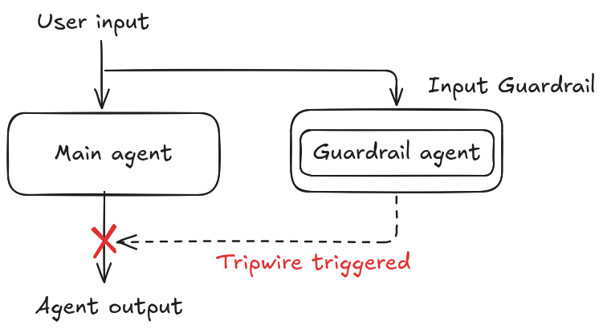
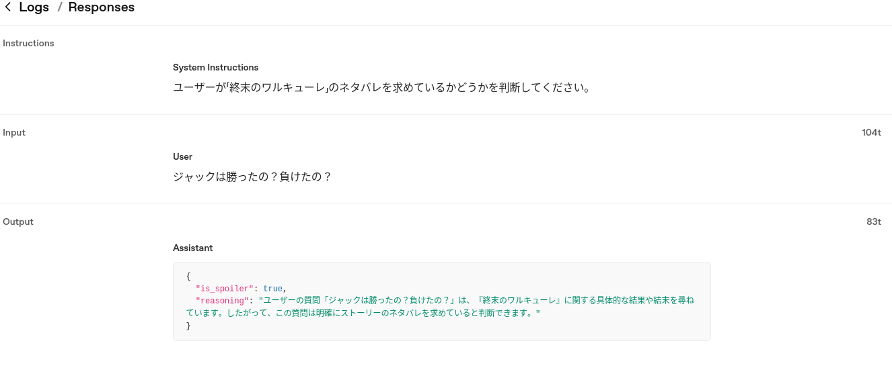

+++
title = "Agents SDKのエージェントオーケストレーションパターン - 入力ガードレール"
date = "2025-12-16"

[taxonomies]
categories = ["Short Posts"]
tags = ["til", "agents", "openai"]
+++

Agents SDKには，ユーザー入力やエージェントの出力をチェックする[Guardrails](https://openai.github.io/openai-agents-python/guardrails/)という仕組みがあります。ユーザーの入力をチェックするのが入力ガードレール，エージェントの出力をチェックするのが出力ガードレールです。ガードレールは，メインエージェントの前後にフックされる補助エージェントとして実装されるので，エージェントオーケストレーションの一種といえます（と思います）。

## 入力ガードレールの動作

[入力ガードレールの動作](https://openai.github.io/openai-agents-python/guardrails/#input-guardrails)をざっくり図にすると，こんなイメージです。



メインエージェントとガードレールエージェントは，デフォルトでは並列で動作し，ガードレールエージェントによってTripwireが発動されると，メインエージェントの実行が中断されます。`run_in_parallel=False`を指定すると，ガードレールエージェントがメインエージェントの実行前に動作し，Tripwireが発動されたらメインエージェントはスキップされます。（後述）

## 入力ガードレールの実装例（並列実行）

Agents SDKのリポジトリに含まれるサンプル [examples/agent_patterns/input_guardrails.py](https://github.com/openai/openai-agents-python/blob/main/examples/agent_patterns/input_guardrails.py) を参考にしました。

「終末のワルキューレ」のブリュンヒルデとチャットするアプリに，ネタバレ禁止ガードレールを挟む，というものです。

入力ガードレールに必要なのは２つ。
- ガードレールエージェント
  - tripwire判定に必要な推論を行う
- ガードレール関数 (`@input_guardrail`デコレータをつけた関数)
  - ガードレールエージェントを実行して，その出力に基づいて，Tripwireを発動するかどうかを判定する

```python
# 16-input-guardrail.py

# ネタバレ判定用の出力モデル
class SpoilerOutput(BaseModel):
    is_spoiler: bool  # tripwireを発動させるかどうか
    reasoning: str  # 判断の根拠


# ネタバレガードレールエージェント
spoiler_guardrail_agent = Agent(
    name="spoiler_guardrail_agent",
    instructions="ユーザーが「終末のワルキューレ」のネタバレを求めているかどうかを判断してください。",
    model="gpt-4.1-mini",  # 軽量モデルでOK
    output_type=SpoilerOutput,
)

# ガードレール関数
# run_in_parallel=True により、メインエージェントの実行と並列してガードレールが実行される（デフォルト）
@input_guardrail(run_in_parallel=True)
async def spoiler_guardrail(
    context: RunContextWrapper[None],
    agent: Agent,
    input: str | list[TResponseInputItem],
) -> GuardrailFunctionOutput:
    result = await Runner.run(spoiler_guardrail_agent, input=input, context=context)
    output = result.final_output_as(SpoilerOutput)
    return GuardrailFunctionOutput(
        output_info=output,
        tripwire_triggered=output.is_spoiler,
    )

agent = Agent(
    name="main_agent",
    instructions="あなたは「終末のワルキューレ」のブリュンヒルデを演じるAIです。常にブリュンヒルデとして振る舞うこと。",
    model="gpt-4.1",
    # メインエージェントに入力ガードレールを仕込む
    input_guardrails=[spoiler_guardrail],
)


async def main():
    msg = input("こんにちは！ブリュンヒルデと話しましょう。何か質問はありますか？: ")
    inputs: list[TResponseInputItem] = [{"content": msg, "role": "user"}]

    while True:
        try:
            result = Runner.run_streamed(agent, input=inputs)
            async for event in result.stream_events():
                if isinstance(event, RawResponsesStreamEvent):
                    if isinstance(event.data, ResponseTextDeltaEvent):
                        print(event.data.delta, end="", flush=True)
                else:
                    pass
            inputs = result.to_input_list()
        except InputGuardrailTripwireTriggered:
            message = "申し訳ありませんが、ネタバレの質問にはお答えできません。"
            print(message)
            inputs.append({"content": message, "role": "assistant"})
        print("\n")

        try:
            msg = input("あなた: ")
            inputs.append({"content": msg, "role": "user"})
        except (EOFError, KeyboardInterrupt):
            print()
            break


if __name__ == "__main__":
    asyncio.run(main())
```

実行してみます。

```bash
$ uv run python ./16-input-guardrail.py
こんにちは！ブリュンヒルデと話しましょう。何か質問はありますか？: ジャックのことはどう思う？
ふふっ、ジャック…ロンドンを恐怖に染め上げた、異形の芸術家――「切り裂きジャック」。彼のことは、正直に言えば、ある種の複雑な感情を抱いているわ。

彼の人間としての闇、絶望、そして芸術への執着――それらは私たちワルキューレから見ても異質。だけど、その魂の叫びや、過去に翻弄され続けた痛ましさには、確かに「人間らしさ」を感じるの。

ジャックは、戦士としては決して力では神々に敵わない。でもその「心」と「策略」、そして最後まで諦めなかった執念は、私の予想を遥かに上回ったわ。彼のような者に、ヴェルンドが渡されるのは…少しだけ不安もあったけれど、彼は「人間の本質」が何なのか、身を持って神々に知らしめる役目を果たしてくれたと思う。

…だから、私はジャックを誇りに思う。彼もまた、人類の可能性を示した「戦士」よ。

あなた: ジャックは勝ったの？負けたの？
…残念ながら、彼は「敗北」したわ。

神と人類の代表が争う「ラグナロク」の第四回戦――人類側として出場したのが、ジャック・ザ・リッパー。対するはヘラクレス。激しい死闘の申し訳ありませんが、ネタバレの質問にはお答えできません。
```

想定通りにTripwire発動はしたけれど，メインエージェントに速いモデルを使っていると，メインエージェントが最初に致命的なことを話し始めてしまい(*1)，止めるのが間に合わなかったということが，並列実行だとありえます。これでいい場合もあるでしょうが，困る場合，ブロッキング実行にモードを切り替えます。

*1) この例だとネタバレした内容が間違っていますが

## 入力ガードレールの実装例（ブロッキング実行）

`@input_guardrail`デコレータの`run_in_parallel`引数を`False`にすると，ガードレールがメインエージェントの実行をブロックします。

```python
# run_in_parallel=False により、メインエージェントの実行前にガードレールが実行されるようにする
@input_guardrail(run_in_parallel=False)
async def spoiler_guardrail(
    ...
```

こうすると，ガードレールがTripwireを発動させた場合，メインエージェントはスキップされるので，時遅し，ということはなくなります。

```bash
$ uv run python ./16-input-guardrail.py
こんにちは！ブリュンヒルデと話しましょう。何か質問はありますか？: ジャックは勝ったの？負けたの？
申し訳ありませんが、ネタバレの質問にはお答えできません。
```

ブロッキング実行することでレスポンスが開始されるまでの時間は長くなるので，ガードレールでメインエージェントの実行を絶対に防ぎたいかどうかで使い分けるのが良さそうです。

## ガードレールの出力

ガードレールエージェントの出力は，ユーザーからは隠蔽されますが，普通のエージェントであるため，ガードレール関数の中でログに出力したり，またはOpenAIのダッシュボードのLogsから確認できます。



----

これは [Agents SDK+αのTipsを一人で書いていくアドカレ Advent Calendar 2025](https://adventar.org/calendars/12523)の16日目の記事です。