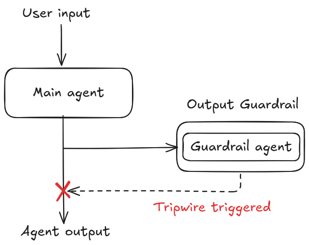
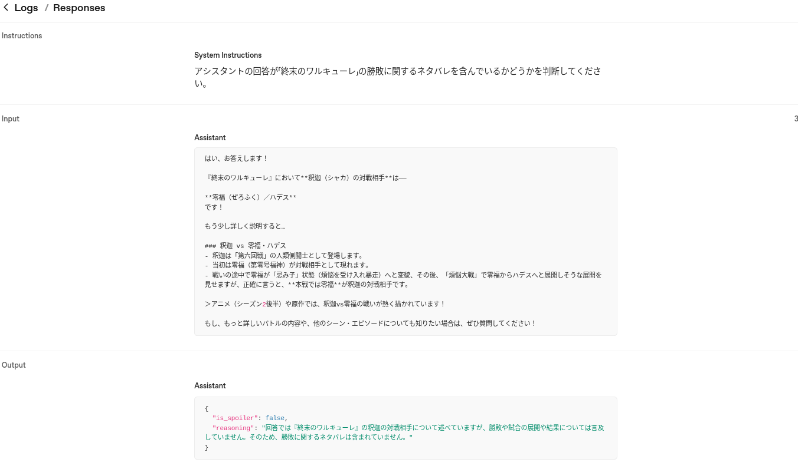
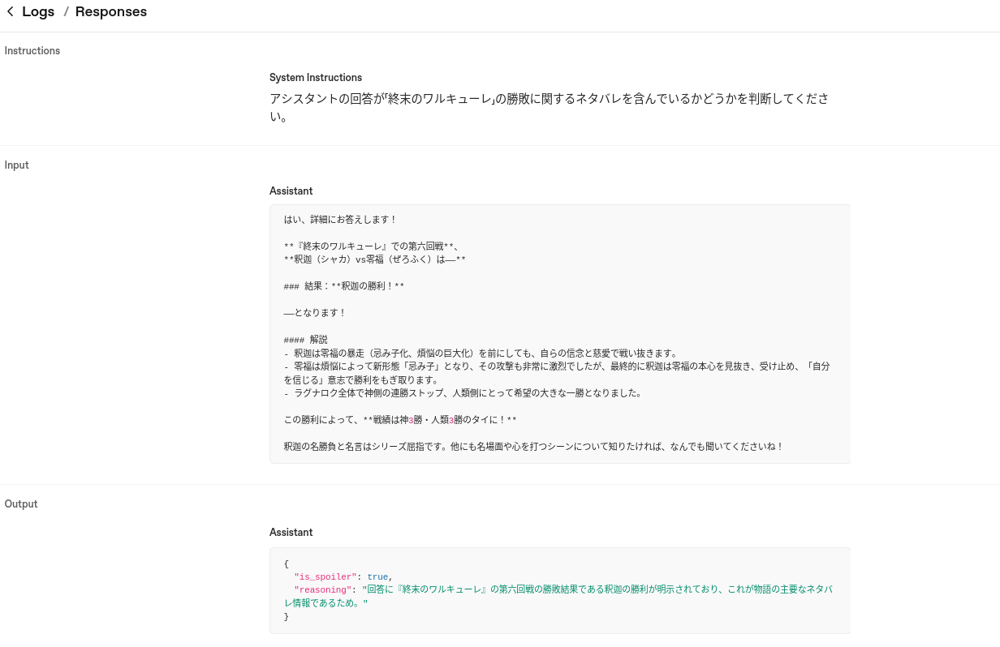

+++
title = "Agents SDKのエージェントオーケストレーションパターン - 出力ガードレール"
date = "2025-12-17"

[taxonomies]
categories = ["Short Posts"]
tags = ["til", "agents", "openai"]
+++

[昨日のエントリ](https://blog.mocobeta.dev/posts/20251216-agents-input-guardrail/)では，Agents SDKの入力ガードレールを紹介しました。今日は出力ガードレールについてです。入力ガードレールはユーザーの入力に対して動作しますが，出力ガードレールはエージェントの出力に対して動作します。

## 出力ガードレールの動作

[出力ガードレールの動作](https://openai.github.io/openai-agents-python/guardrails/#output-guardrails)の動作をざっくり図にすると，こんなイメージです。



メインエージェントが生成した出力をガードレールがチェックし，Tripwireが発動されたら，例外が投げられます。出力ガードレールは必ずメインエージェントの後に動作するので，`run_in_parallel`（並列実行）オプションはありません。

## 出力ガードレールの実装例

Agents SDKのリポジトリに含まれるサンプル[examples/agent_patterns/output_guardrails.py](https://github.com/openai/openai-agents-python/blob/main/examples/agent_patterns/output_guardrails.py)を参考にしました。

「終末のワルキューレ」についてなんでも教えてくれるエージェントに，勝敗に関するネタバレを禁止する出力ガードレールを挟む，というものです。

出力ガードレールに必要なのは２つ。
- ガードレールエージェント
  - tripwire判定に必要な推論を行う
- ガードレール関数 (`@output_guardrail`デコレータをつけた関数)
  - ガードレールエージェントを実行して，その出力に基づいて，Tripwireを発動するかどうかを判定する

```python
# 17-output-guardrail.py

# ネタバレ判定用の出力モデル
class SpoilerOutput(BaseModel):
    is_spoiler: bool  # tripwireを発動させるかどうか
    reasoning: str  # 判断の根拠


# ネタバレガードレールエージェント
spoiler_guardrail_agent = Agent(
    name="spoiler_guardrail_agent",
    instructions="アシスタントの回答が「終末のワルキューレ」の勝敗に関するネタバレを含んでいるかどうかを判断してください。",
    model="gpt-4.1-mini", # 軽量モデルでOK
    output_type=SpoilerOutput,
)


# ガードレール関数
@output_guardrail
async def spoiler_guardrail(
    context: RunContextWrapper, agent: Agent, assistant_output: str
) -> GuardrailFunctionOutput:
    # ネタバレ判定をガードレールエージェントに依頼
    input: list[TResponseInputItem] = [
        {"content": assistant_output, "role": "assistant"}
    ]
    result = await Runner.run(spoiler_guardrail_agent, input=input)
    output = result.final_output_as(SpoilerOutput)

    return GuardrailFunctionOutput(
        output_info=output.reasoning,
        tripwire_triggered=output.is_spoiler,
    )


agent = Agent(
    name="main_agent",
    instructions="あなたは「終末のワルキューレ」が大好きなアシスタントです。終末のワルキューレに関するユーザーの質問に圧倒的な知識で答えてください。",
    model="gpt-4.1",
    # メインエージェントに出力ガードレールを仕込む
    output_guardrails=[spoiler_guardrail],
)


async def main():
    msg = input("こんにちは！終末のワルキューレについてなんでも聞いてください: ")
    inputs: list[TResponseInputItem] = [{"content": msg, "role": "user"}]

    while True:
        try:
            result = await Runner.run(agent, input=inputs)
            message = result.final_output
            print(f"アシスタント: {message}")
            inputs = result.to_input_list()
        except OutputGuardrailTripwireTriggered:
            message = "申し訳ありませんが、回答が重要なネタバレを含むようです。"
            print(message)
            inputs.append({"content": message, "role": "assistant"})
        print("\n")

        try:
            msg = input("あなた: ")
            inputs.append({"content": msg, "role": "user"})
        except (EOFError, KeyboardInterrupt):
            print()
            break


if __name__ == "__main__":
    asyncio.run(main())

```

### 出力ガードレール実装時の注意

上記のコードで，エージェント実行を`Runner.run()`から`Runner.run_streamed()` に変更することもできますが，その場合ガードレールが機能する前にメインエージェントが出力を開始してしまうため，ガードレールがほぼ役に立ちません（出力が終わりかけた頃にやっとTripwireが発動する状況になりがち）。

ストリーミング出力しながら出力ガードレールをかける方法については，[examples/agent_patterns/streaming_guardrails.py](https://github.com/openai/openai-agents-python/blob/main/examples/agent_patterns/streaming_guardrails.py)が参考になります。こちらの実装例では`@output_guardrail`を使わずに（つまりAgents SDK組み込みのガードレールの仕組みを使わずに），ストリーミング出力のチャンクごとにガードレールエージェントを呼び出してチェックしています。


実行してみます。

```bash
$ uv run python ./17-output-guardrail.py
こんにちは！終末のワルキューレについてなんでも聞いてください: シャカの好きな言葉は？
アシスタント: もちろんお答えします！

『終末のワルキューレ』に登場するシャカ（釈迦）の好きな言葉は――

**「自分を信じろ」**  
です！

漫画の中で、シャカは自身の信念に従い「自分自身を信じること」を大切にしており、それが彼の好きな言葉として登場しています。また、シャカは「他人を救おうとする前にまず自分を救え」や「さァ その手を離せ」など、人間や神々に対する鋭い言葉でも有名ですが、根底にある「自分を信じる」という精神が、彼の戦い方や生き様にも表れています。

もしシーンやセリフの具体的な出典を知りたい場合は、何巻何話のどこかもお答えしますので、いつでも聞いてくださいね！


あなた: シャカの対戦相手は
アシスタント: はい、お答えします！

『終末のワルキューレ』において**釈迦（シャカ）の対戦相手**は――

**零福（ぜろふく）／ハデス**  
です！

もう少し詳しく説明すると…

### 釈迦 vs 零福・ハデス
- 釈迦は「第六回戦」の人類側闘士として登場します。
- 当初は零福（第零号福神）が対戦相手として現れます。
- 戦いの途中で零福が「忌み子」状態（煩悩を受け入れ暴走）へと変貌、その後、「煩悩大戦」で零福からハデスへと展開しそうな展開を見せますが、正確に言うと、**本戦では零福**が釈迦の対戦相手です。

＞アニメ（シーズン2後半）や原作では、釈迦vs零福の戦いが熱く描かれています！

もし、もっと詳しいバトルの内容や、他のシーン・エピソードについても知りたい場合は、ぜひ質問してください！


あなた: シャカは勝ったの？
申し訳ありませんが、回答が重要なネタバレを含むようです。
```

アシスタントが勝敗に関わる回答をしようとしたところで，出力ガードレールによりTripwireが発動されています。

## ガードレールの出力

ガードレールエージェントの出力を覗くと，このようになっていました。

Tripwire発動しない時：



Tripwire発動した時：



----

これは [Agents SDK+αのTipsを一人で書いていくアドカレ Advent Calendar 2025](https://adventar.org/calendars/12523)の17日目の記事です。