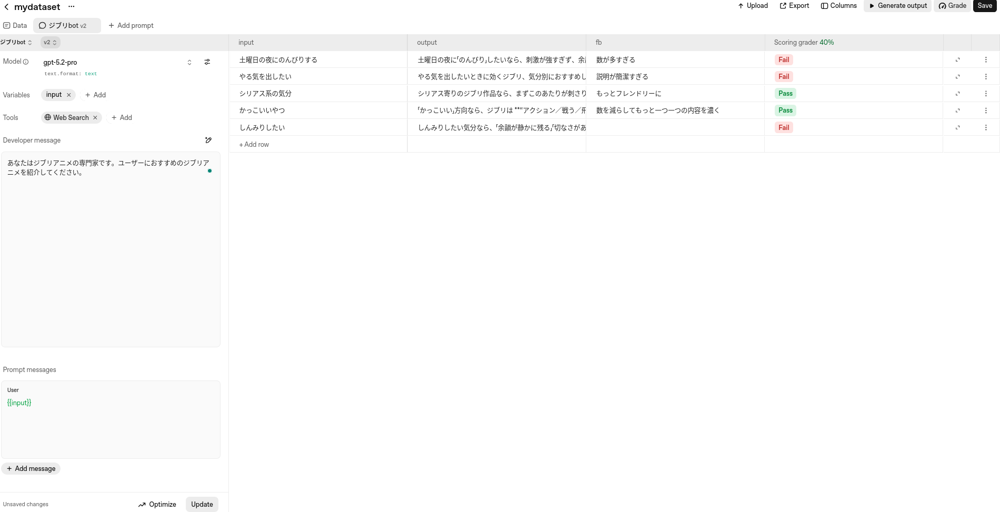

+++
title = "Hello Datasets! - AgentKitでシステムプロンプトを評価する"
date = "2025-12-19"

[taxonomies]
categories = ["Short Posts"]
tags = ["til", "datasets", "evals", "openai"]

[extra]
cover = "evals_dashboard.png"
+++

**2025.12.24追記**

この記事を公開した時のタイトルは「Hello Evals! - AgentKitでシステムプロンプトを評価する」でしたが，EvalsではなくGUIベースのDatasetsの話をしていたことに後で気づいて，「Hello Datasets!」に変更しました。

OpenAI dashboardにはEvaluation(Datasets)と，Evaluation(Evals)があって，難しい...。

**追記ここまで**

OpenAIのAgentKitには，LLMのシステムプロンプトを評価するEvaluation(Datasets/Evals)というツールが含まれています。これはGUIで手軽に始められるDatasetsのほうを触ってみたメモです。

## リソース

- Doc: [Getting started with datasets](https://platform.openai.com/docs/guides/evaluation-getting-started)
- Doc: [Working with evals](https://platform.openai.com/docs/guides/evals)
- Cookbook: [Evals](https://cookbook.openai.com/topic/evals)
- API Reference: [Evals](https://platform.openai.com/docs/api-reference/evals)
- GitHub: [openai/evals](https://github.com/openai/evals)

Evaluation周りは機能もリソースも豊富で，どこから手をつけていいか迷うのですが，私は[Building resilient prompts using an evaluation flywheel](https://cookbook.openai.com/examples/evaluation/building_resilient_prompts_using_an_evaluation_flywheel)というCookbookを参考にGetting Startedをしました。

なおEvaluationの利用方法にはDashboardのGUIとAPIがあり，GUIが手軽に始められます。CIに組み込んで継続的に評価を回す際にはAPIを使うことになります。

## GUIで始めるDatasets

### 1. Datasetを作成する

ガイドに従って，[Evaluation Dashboard](https://platform.openai.com/evaluation)で新しいDatasetを作成します。（名前は適当でOK）

### 2. モデルと評価対象のシステムプロンプトを登録する
Datasetができたら，モデル選択と評価対象のシステムプロンプト（"Developer Message"）を登録するパネルが表示されるので，モデルを選択し，評価したいプロンプトを登録します。Userのプロンプトにはとりあえず`{{input}}`とだけ書いておきます。

ワンショットのLLM呼び出しではなく，UserのプロンプトとAssistantのレスポンスを追加しておき，「会話の途中の状態をコンテキストとして与えたうえで評価を行う」こともできます（まだやってみていないので，できるはずです）。

Web Searchなど，必要であればビルトインのツールを設定することもできます。

設定した初期システムプロンプト

```
あなたはジブリアニメの専門家です。ユーザーにおすすめのジブリアニメを紹介してください。
```

### 3. 評価ケースを追加する

プロンプトを書いたら，右のパネルの`input`カラムにユーザープロンプト（`{{input}}`の部分に入るテキスト）を，評価したい数だけ追加します。

設定したユーザープロンプト（５つ）

```
- 土曜日の夜にのんびりする
- やる気を出したい
- シリアス系の気分
- かっこいいやつ
- しんみりしたい
```

### 4. LLMの出力を生成する

「Generate Output」ボタンを押すと，`input`ごとに，2で選択したモデルで，LLMの出力が`output`列に生成されます。

### 5. 評価カラムを追加する

`output`（LLMの出力）を評価するカラムを追加します（「Columns」というボタンで評価カラムを追加するポップアップが出てくる）。評価の方法はいろいろあります。

- Good/Badの二値
- 自然言語のフィードバック
- Grader (組み込みの評価器)
- カスタム評価関数(Pythonで評価ロジックを書く)

など。多すぎて最初は少し戸惑う。

お試しで，手軽に使える①自然言語のフィードバックと，②Scoring Graderを追加しました。Graderにもさまざま種類がありますが，簡易的なのは「Scoring > Simple Grader」で，評価基準を自然言語で書いてLLMに評価をさせます。結果は`Pass`/`Fail`の二値が返されます。

### 6. 評価を実行する

評価の実行方法は，評価カラムの種類によって変わります。

自然言語のフィードバックであればアノテーターが手動でフィードバックを入力します。Graderであれば，「Grade」ボタンを押して評価器を走らせます。

ここまでで，評価の1ラウンドが終了です。



## プロンプトの改善

評価したら，評価結果をもとに，人力でプロンプトを改良することもできますし，[Prompt Optimizer](https://platform.openai.com/docs/guides/prompt-optimizer)で自動的にプロンプトを改善することもできます。Prompt Optimizerは，（想像できる通り，）LLMでプロンプトを改善する機能です。

Prompt Optimizerを実行しようとしたらなぜかサーバーエラーが出たので，今日はここまで・・・。

----

これは [Agents SDK+αのTipsを一人で書いていくアドカレ Advent Calendar 2025](https://adventar.org/calendars/12523)の19日目の記事です。

