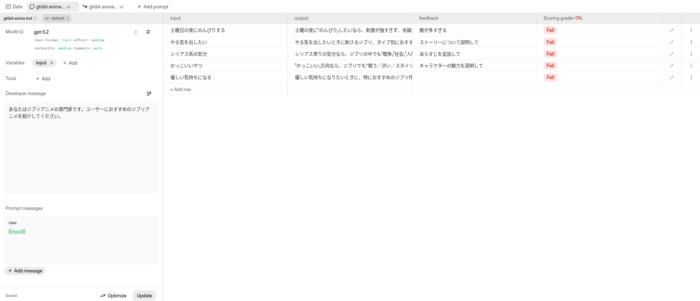

+++
title = "AgentKitでシステムプロンプトの自動最適化 - Prompt optimizer"
date = "2025-12-20"

[taxonomies]
categories = ["Short Posts"]
tags = ["til", "evals", "openai"]

[extra]
cover = "evals_dashboard_2.png"
+++

[昨日のエントリ](https://blog.mocobeta.dev/posts/20251219-hello-evals/)では，Evals dashboardを使って，LLMのシステムプロンプトを評価する方法を紹介しました。今回はその続きで，Evalsの結果をもとにシステムプロンプトを自動最適化するPrompt optimizerを動かしてみたメモです。

ドキュメント：
[Prompt optimizer](https://platform.openai.com/docs/guides/prompt-optimizer)

Prompt optimizerを使うには，最低3つのrow（評価ケース）と，各rowにつき1つ以上の評価カラムが必要です（評価ケース，評価カラムについては[昨日のエントリ](https://blog.mocobeta.dev/posts/20251219-hello-evals/)で触れました）。

Prompt optimizerは，アノテーターが付与したアノテーション，フィードバック，Graderによる評価を総合して，なんらかのLLMマジックを実行してシステムプロンプトを改善します。とはいえ魔法の杖ではないので，Prompt optimizerのアウトプットの質は，付与したアノテーションやGraderの質に依存します（それはそう）。

> The effectiveness of prompt optimization depends on the quality of your graders. We recommend building narrowly-defined graders for each of the desired output properties where you see your prompt failing.

-- [Optimize your prompt](https://platform.openai.com/docs/guides/prompt-optimizer#optimize-your-prompt) より引用

## Prompt optimizerを実行する

アノテーションとGrader実行を完了させてから，Evals画面の左下にある，目立たない「Optimize」ボタンを押すと，Prompt optimizerの実行が開始します。row数や評価カラム数によって変わりそうですが，数分で完了しました。

改善前のシステムプロンプト

Optimize後のシステムプロンプト

Evalsで作ったシステムプロンプトはバージョニングができるため，Optimize後のプロンプトが気に入った場合は新しいバージョン番号を振り，履歴を残しながらOptimizeを繰り返すことができます。

----

これは [Agents SDK+αのTipsを一人で書いていくアドカレ Advent Calendar 2025](https://adventar.org/calendars/12523)の20日目の記事です。

