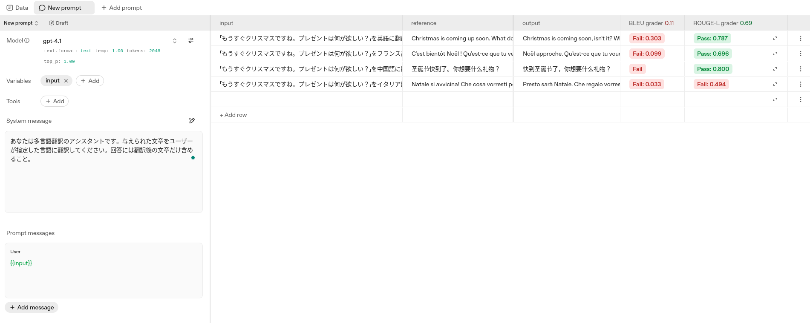

+++
title = "AgentKit Evalsで使えるテキスト比較Grader - String Check GraderとText Similarity Grader"
date = "2025-12-21"

[taxonomies]
categories = ["Short Posts"]
tags = ["til", "evals", "openai"]

[extra]
cover = "text_similarity_grader.png"
+++

[Hello Evals! - AgentKitでシステムプロンプトを評価する](https://blog.mocobeta.dev/posts/20251219-hello-evals/)で触れたように，Evalsには，人手によるアノテーションの他，Graderという自動評価の仕組みがあります。

組み込みGrader一覧はこちら：
[Add graders](https://platform.openai.com/docs/guides/evaluation-getting-started#add-graders)

今回は，テキスト比較に使えるString Check GraderとText Similarity Graderを動かしてみたメモです。

## String Check Grader

リファレンス: [String Check Grader](https://platform.openai.com/docs/api-reference/graders/string-check)

シンプルな文字列マッチを行うGraderです。比較演算子は`eq`, `ne`, `like`, `ilike`をサポート。

たとえば，`input.reference`（答え。入力で与える）と`sample.output_text`（LLMの出力テキスト）が完全一致するかを評価するGraderを定義して動かすと，以下のようになります。お題は動物当てクイズです。

完全一致なので，もちろん漢字・ひらがな・カタカナ表記の違いも区別されます。カテゴリカルなタスク設定に向いてそう。

## Text Similarity Grader

リファレンス: [Text Similarity Grader](https://platform.openai.com/docs/api-reference/graders/text-similarity)

テキストの類似度で評価を行うGraderです。メトリクスとして`cosine`, `fuzzy_match`, `bleu`, `gleu`, `meteor`, `rouge_1`, `rouge_2`, `rouge_3`, `rouge_4`, `rouge_5`, `rouge_l`をサポート。翻訳や要約といった生成タスクで使われる指標がひととおりサポートされています。

たとえば，`input.reference`（答え。入力で与える）と`sample.output_text`（LLMの出力テキスト）のBLEUスコアとROUGE-Lスコアを計算するGraderを定義して動かすと，以下のようになります。お題は日本語から任意言語への翻訳です。

----

これは [Agents SDK+αのTipsを一人で書いていくアドカレ Advent Calendar 2025](https://adventar.org/calendars/12523)の21日目の記事です。

