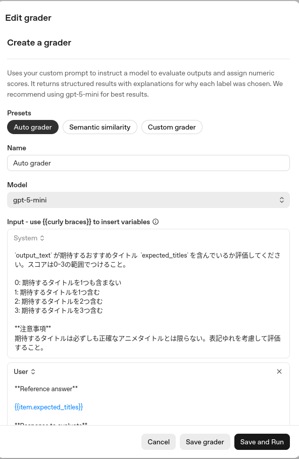
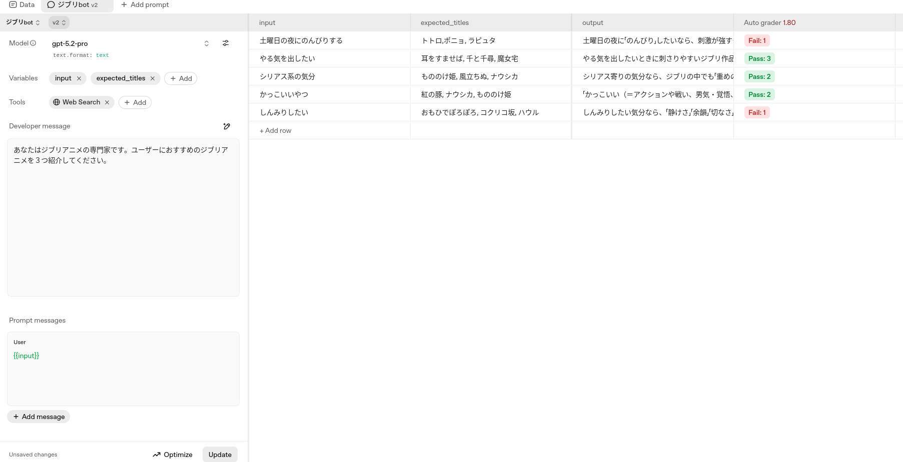

+++
title = "AgentKit Evalsで使えるLLM Grader - Score Model Grader"
date = "2025-12-22"

[taxonomies]
categories = ["Short Posts"]
tags = ["til", "evals", "openai"]

[extra]
cover = "score_grader_result.png"
+++

[昨日のエントリ](https://blog.mocobeta.dev/posts/20251221-evals-grader/)の続きで，Evalsで使えるGrader（評価器）のうち，LLMベースのScore Model Graderを試してみたメモです。柔軟な設定ができ，おそらく最も利用シーンが多いGraderかなと思います。

## Score Model Grader

リファレンス: [Score Model Grader](https://platform.openai.com/docs/api-reference/graders/score-model)

LLMの出力テキストをLLMの評価器で評価し，スコアを付与します。スコア範囲は任意の範囲（[0.0, 1.0], [1, 10]など）を指定できます。評価基準はプロンプトで指定し，ラベル付きデータがあればそれも評価プロンプト内でデータとして利用できます。ラベル付きデータはできれば用意したほうが良い評価ができると思います。

たとえば，「おすすめジブリアニメを３つ紹介するタスク」で，正解ラベルとLLMの出力を比較し，評価基準「表記ゆれを考慮しながら，正解ラベルと出力に含まれるタイトルの一致数を数えて，一致が多ければ高スコアを与える。スコアの範囲は0から3まで」で出力にスコアを付与するGrader定義は以下のようになります。（GUIから設定する場合）

Pass/Failの閾値を2.0に設定してGraderを実行すると，たとえば以下のようになります。スクリーンショットでは分かりづらいのですが，「魔女宅」と「魔女の宅急便」が同じタイトルを指していることを評価器が理解しています。単純な文字列マッチでは難しい名寄せのような処理が簡易にできる点が，LLMを活用するひとつの大きな利点です。

## Label Model Grader

LLMベースの評価機には，もう一つ，Label Model Graderもあります。こちらは，評価結果をスコアではなくラベル（カテゴリ）で返すGraderですが，いい例が思いつかなかったのでリファレンスだけ貼っておきます。。。

リファレンス: [Label Model Grader](https://platform.openai.com/docs/api-reference/graders/label-model)

----

これは [Agents SDK+αのTipsを一人で書いていくアドカレ Advent Calendar 2025](https://adventar.org/calendars/12523)の22日目の記事です。
