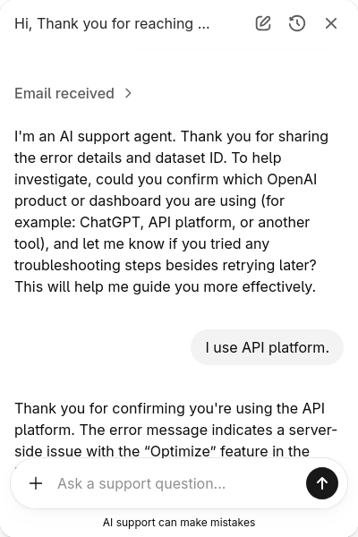

+++
title = "OpenAIのAIサポートbotにエラー報告をすると起こること"
date = "2025-12-23"

[taxonomies]
categories = ["Short Posts"]
tags = ["til", "openai"]
+++

[Hello Evals! - AgentKitでシステムプロンプトを評価する](https://blog.mocobeta.dev/posts/20251219-hello-evals/)を書いていた時に発生した，「Optimize prompt」がサーバエラーで動かない問題が，数日待ってもEvalを作り直しても解消しなくて困ったので，[OpenAIのヘルプセンター](https://help.openai.com/en/)から問い合わせました。

問い合わせフォームやコンタクト先のメールアドレスの記載はなく，チャットボットが1次対応をする仕組みになっています（まあそれはそう）。

## 送ったメッセージ

エラーメッセージのスクリーンショットとテキストを送りました。人間のサポート担当者なら困っている状況が伝わるはず，という説明にしたつもり。


```txt
I encountered a server error when attempting to use the “Optimize” feature in the Evaluation dashboard. 
The issue persisted even after retrying the following day. 
Could you please help investigate this issue?

Dataset ID: dset_XXXXXX
```

## AIサポートbotの回答

数秒後に返信が来ました。



## AIサポートbotの対応

数ターンのやり取りを経て，サポートbotがやってくれた対応は以下：

- スクリーンショットとテキストメッセージから，状況を把握したことを伝える
- 問題はユーザー側ではなくシステム側にあり，OpenAIサイドでの対応が必要である，ということを伝える
- ユーザー側でやってほしいこと（ログアウト／再ログイン，ブラウザのキャッシュクリア，別ブラウザで試す）を案内する
- エスカレーションのためIssueを作成したことを伝える
- 追加で伝えてほしい情報を案内する

原因がOpenAIのプラットフォーム側にあり，ユーザー側でできるトラブルシューティングはない，というのを初手で明確にしてくれた点が，ユーザー体験として特に良かったです。あと，時々入力をしかけて途中で止まっていたので，不用意なことを言わないように，多分ガードレール的な仕組みが入っていそうでした。細かい挙動含めてUXの参考になる。

## その後

個人アカウントということもあって素早いレスはあまり期待していなかったのですが，2日後にサポート担当者がメールをくれました。対応は継続中。

----

これは [Agents SDK+αのTipsを一人で書いていくアドカレ Advent Calendar 2025](https://adventar.org/calendars/12523)の23日目の記事です。テーマと全然関係ない話になってしまいましたが。


