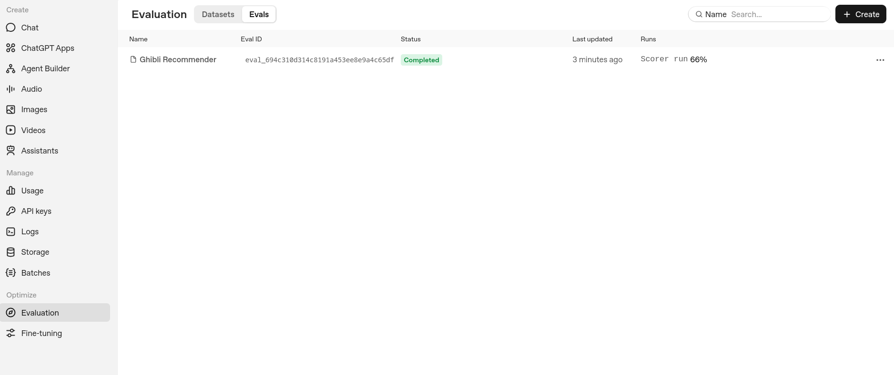
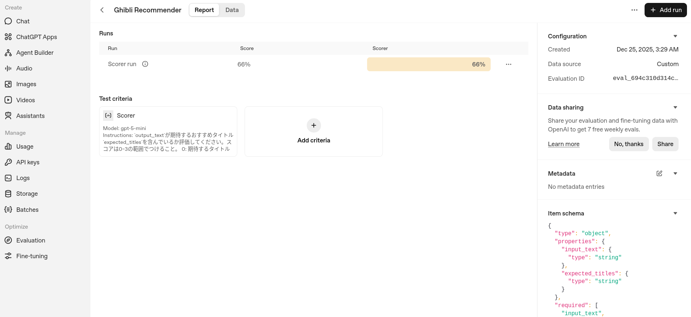
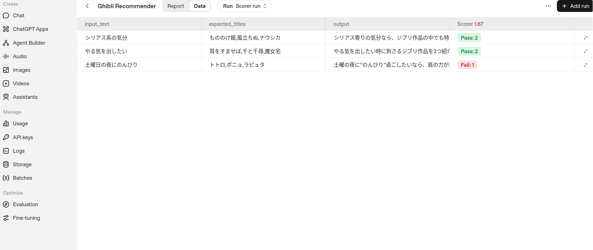

+++
title = "OpenAIのEvals APIに入門する"
date = "2025-12-24"

[taxonomies]
categories = ["Short Posts"]
tags = ["til", "evals", "openai"]

[extra]
cover = "evalrun_detail.png"
+++

[Hello Datasets! - AgentKitでシステムプロンプトを評価する](https://blog.mocobeta.dev/posts/20251219-hello-evals/)では，GUIからシステムプロンプトの評価データセットを作って評価を実行しましたが，[Evals API](https://platform.openai.com/docs/api-reference/evals)を使うと，プログラマブルに評価の作成や実行管理ができます。

この記事は，[AgentKit Evalsで使えるLLM Grader - Score Model Grader](https://blog.mocobeta.dev/posts/20251222-evals-grader-2/)でGUIで作ったのと同等のプロンプト評価をEvals APIで再現したメモです。

評価系のツールキットはだいたい学習に時間が必要ですが，Evals APIも難しい部類のツール（と思う）です。独特の癖に慣れるまでは少し頑張る必要がありそう。

## リファレンス

- Quickstart: [Working with evals](https://platform.openai.com/docs/guides/evals)
- API doc: [Evals API Reference](https://platform.openai.com/docs/api-reference/evals)

## 評価の作成から実行までの流れ

4ステップあります。

1. Evalオブジェクトを作成する

   Evalオブジェクトは，評価に必要なデータソース定義と，評価基準（Grader）をまとめた構造体です。[Create Eval](https://platform.openai.com/docs/api-reference/evals/create)で作成します。

2. テストデータをアップロードする

   Evalの実行に使うテストデータを[Files](https://platform.openai.com/docs/api-reference/files)にアップロードします。テストデータのフォーマットはJSONLです。
   「テストデータ」とは具体的には，ユーザープロンプトや期待するAssistantレスポンスなどを含みます。Eval作成時に定義したデータソース定義と一致している必要があります。

3. Evalを実行する

   [Create Eval Run](https://platform.openai.com/docs/api-reference/evals/createRun)で，Evalオブジェクトにテストデータを渡して評価を実行します。

4. Eval Runの結果を取得する

   [Get Eval Run](https://platform.openai.com/docs/api-reference/evals/getRun)で，実行したEval Runの結果を取得します。

以下は具体的なコード例です。開発時はJupyter Notebookと，[Evalsダッシュボード](https://platform.openai.com/evaluation?tab=evals)を併用するのが便利です。Evalsダッシュボードでは，APIから作成したEvalやRunを確認できます。（ダッシュボードでEval/Eval Run作成もできますが，入力項目が多くGUIのほうが手間がかかるので，作成はAPIを推奨です。）

### 1. Evalオブジェクトを作成する

```python
from openai import OpenAI
client = OpenAI()

eval_obj = client.evals.create(
  name = "Ghibli Recommender",
  # データソース定義
  data_source_config = {
    "type": "custom",
    # 評価で使うデータのスキーマ定義。評価器（Grader）はここで定義したプロパティをすべて参照できる。
    "item_schema": {
        "type": "object",
        "properties": {
            "input_text": {"type": "string"}, # ユーザーインプット
            "expected_titles": {"type": "string"},  # 期待する結果
        },
        "required": ["input_text", "expected_titles"],
    },
    # 評価でアシスタントの出力を使うにはこれをTrueにする必要がある
    "include_sample_schema": True,
  },
  # 評価基準（Grader）定義。複数書ける。
  testing_criteria=[
    {
        # 以下はScore Model Graderのリファレンスを参照して作成
        # Graderによって必要なプロパティが異なる
        "type": "score_model",
        "model": "gpt-5-mini",
        "name": "Scorer",
        "input": [
            {
                "content": 
                    (
                        "`output_text`が期待するおすすめタイトル`expected_titles`を含んでいるか評価してください。スコアは0~3の範囲でつけること。\n\n"
                        "0: 期待するタイトルを1つも含まない\n"
                        "1: 期待するタイトルを1つ含む\n"
                        "2: 期待するタイトルを2つ含む\n"
                        "3: 期待するタイトルを3つ含む\n\n"
                        "**注意事項**\n"
                        "期待するタイトルは必ずしも正確なアニメタイトルとは限らない。表記ゆれを考慮して評価すること。"
                    ),
                "role": "system",
                "type": "message"
            },
            {
                "content": [
                    {
                        "type": "input_text",
                        "text": 
                            (
                                "**Reference answer**\n\n"
                                "{{item.expected_titles}}\n\n"
                                "**Response to evaluate**\n\n"
                                "{{sample.output_text}}"
                            )
                    }
                ],
                "role": "user",
                "type": "message"
            }
        ],
        "range": [0.0, 3.0],
        "pass_threshold": 2.0,
    }
  ]
)
print(eval_obj)
```

レスポンスに含まれる`id`を控えておきます（Eval Run作成時に参照する）。

### 2. テストデータをアップロードする

JSONLで，データソース定義で指定したプロパティ`item.input_text`, `item.expected_titles`を含むデータをJSONLで用意します。

```python
{"item": {"input_text": "土曜日の夜にのんびり", "expected_titles": "トトロ,ポニョ,ラピュタ"}}
{"item": {"input_text": "やる気を出したい", "expected_titles": "耳をすませば,千と千尋,魔女宅"}}
{"item": {"input_text": "シリアス系の気分", "expected_titles": "もののけ姫,風立ちぬ,ナウシカ"}}
```

このファイルをFiles APIでアップロードします。

```python
from openai import OpenAI
client = OpenAI()

with open("ghibli-recommender.jsonl", "rb") as f:
    file = client.files.create(
        file=f,
        purpose="evals",
    )

print(file)
```

レスポンスに含まれる`id`を控えておきます（Eval Run作成時に参照する）。

### 3. Evalを実行する

EvalのIDと，テストデータファイルのIDを指定して，Eval Runを作成します。

```python
from openai import OpenAI
client = OpenAI()

run = client.evals.runs.create(
    "<EVAL_ID>",  # 1で作成したEvalオブジェクトのID
    name="Scorer run",
    data_source={
        "type": "responses",
        "model": "gpt-5.2",
        "input_messages": {
            "type": "template",
            "template": [
                {"role": "developer", "content": "あなたはジブリアニメの専門家です。ユーザーにおすすめのジブリアニメを３つ紹介してください。"},
                {"role": "user", "content": "{{ item.input_text }}"},
            ],
        },
        "source": {
            "type": "file_id",
            "id": "<FILE_ID>"  # 2でアップロードしたテストデータファイルのID
        },
    },
)

print(run)
```

レスポンスに含まれる`id`を控えておきます（結果取得時に参照する）。

なお，1. のEvalオブジェクト作成が成功しても，Runが失敗することがあります。不正な`testing-criteria`(Grader)が作られてしまい，実行時に失敗することがあるので，Runが失敗したらEvalの定義を頑張ってデバッグしましょう。私はEval定義の中の一部プロパティのint/floatの型ミスでRunに失敗していて，デバッグに3時間かかってつらかった。Eval作成時のvalidationを厳しくしてくれるといいなあ。

### 4. Eval Runの結果を取得する

```python
from openai import OpenAI
client = OpenAI()

run = client.evals.runs.retrieve(
  "<EVAL_ID>",
  "<EVALRUN_ID>"
)
print(run)
```

レスポンスに，Evalで定義したGraderの評価結果がすべて含まれています。

CIに組み込んだり，定時バッチで本番環境でのデグレ検出をする際には，おおむねこのような流れでいけそうです。
またEval/Eval Runの作成の他，削除や一覧取得，実行中Runの停止といった管理APIが用意されています。

## EvalsのGUI（ダッシュボード）

EvalやEval Runの履歴を目視で確認する時は，[Evalsのダッシュボード](https://platform.openai.com/evaluation?tab=evals)を使います。

### Eval一覧



### Eval詳細



### Eval Run詳細



----

これは [Agents SDK+αのTipsを一人で書いていくアドカレ Advent Calendar 2025](https://adventar.org/calendars/12523)の24日目の記事です。


