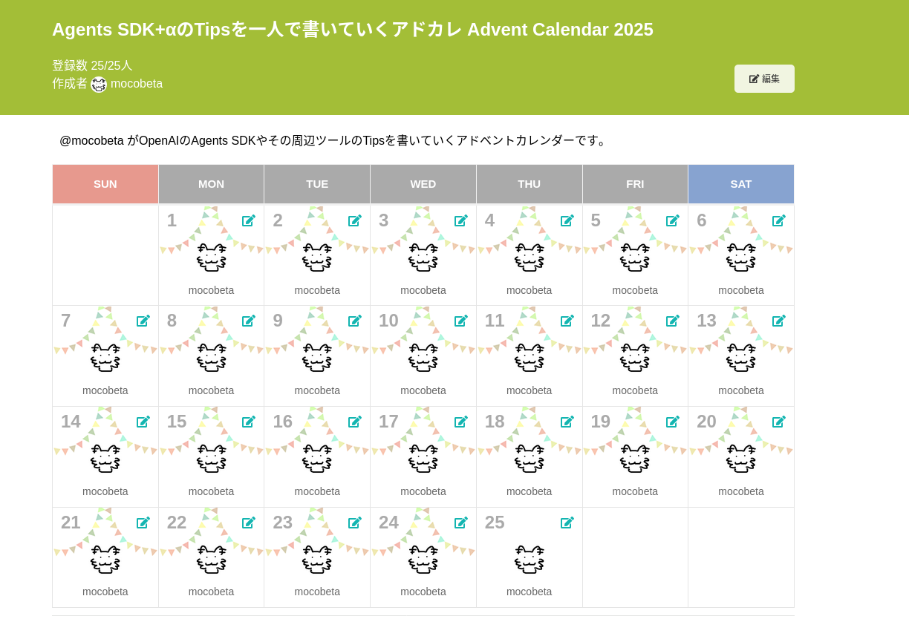

+++
title = "Agents SDKとAgentKitを1ヶ月触り続けた所感"
date = "2025-12-26"

[taxonomies]
categories = ["Short Posts"]
tags = ["prose", "agents", "openai"]

[extra]
cover = "adventar2025.png"
+++

この1ヶ月間，ほそぼそと[Agents SDK+αのTipsを一人で書いていくアドカレ Advent Calendar 2025](https://adventar.org/calendars/12523)というアドベントカレンダーを一人でやっていて，今日が最終日（一日遅れ）なので，雑多に感想を書こうと思います。

## ひとりアドカレなぜやろうと思ったか

AIエージェント開発プロジェクトに最近参加する機会があり，これまでAIエージェントを作ったこともなかったので，短期間で実務で使うレベルまでツールとその背後のコンセプトを習得する必要がありました。早くインプットしながらなるべくただしく理解するためには，強制的にアウトプットする機会を作るのが良さそう，と思ってAdvent Calendarを作りました。ちょうどそんな季節でもありますし。

一人アドカレやってみた感想は，これはしんどいですねｗ 後半は公開がだいたい深夜になりがちでした。でも良いトレーニングになりました。

調べたけど書かなかったこと，これから調べたいことは沢山あるので，銀魂よろしく延長戦をやろうかと思いましたが，寝不足続きで体力的にきつくなってきたので，ここで一区切りにします。

（このネタ伝わる人どれくらいいるんだろう）

## アドカレで触れたツール

AgentKitはOpenAIが提供するエージェント開発のための大きなツールキット群で，[初日](https://blog.mocobeta.dev/posts/20251201-my-first-agent/)に書いたように，私はその一部を触っています。

- [OpenAI Agents Python SDK](https://openai.github.io/openai-agents-python/) と [Responses API](https://platform.openai.com/docs/api-reference/responses)
- [Files API](https://platform.openai.com/docs/api-reference/files)
- [ChatKit Python SDK](https://openai.github.io/chatkit-python/)
- [Evals](https://platform.openai.com/docs/guides/evals)

AgentKitを紹介している記事はたくさんあるので，各ツールの紹介などはそちらに譲ります。

## Agents SDK/ChatKitの感想

他のエージェント開発フレームワークを使ったことがないため，比較はできませんが，低レベルのLLMアプリ開発と，ツールやメモリを持つAIエージェント開発のギャップをきっちり埋めてくれています。マルチエージェントシステムの整理と，tool useのあたりは本当によくできていると思います。メモリ管理については突っ込んで調べられていないので，また別の機会に。

ドキュメント・サンプルコード・クックブックも充実していて助かります。いろいろなところに散らばってるけどググれば大体出てくる。公式ドキュメントに詳しく書いてない部分は，DeepWikiも便利です。SDKはOSSだから，どうしてもわからない時はコードも追えますし。

苦労したのはAgents SDKとChatKitの境界が，実装中にだんだんわかりづらくなってくる点。Agents SDKの層かChatKitの層か混乱することがありました（今もときどき混乱している）。今後インタフェースが整理されていくと良いなと思います。

## Datasets/Evalsの感想

感想を書くほど使えていないという気はしますが，思っていた以上に柔軟でリッチな評価器が作れるなという印象です。正直最初のとっつきはGUIもAPIも難しいけど，クックブックを参照しながら，何ができるかがわかってくると使いこなしたくなります。Prompt optimizerも合わせて，今後は，いわゆるPromptOpsツールに発展していくのでしょうか。

Logs/TracesとEvalがもっとシームレスに連携できると，素敵な世界ができそうに思っています。（Logs/TracesからQuick evalへのつなぎはあるんだけど，こっちは本当に簡単なことしかできなそうなので）

## 最後に

個々の記事は，深くはないが一般的な内容のTipsが多いので，誰かの役に立てば嬉しいです。

間違いや誤解している部分があれば，[@mocobeta (Bluesky)](https://bsky.app/profile/mocobeta.dev)まで教えていただけると幸いです。といいつつ，ハードル高すぎるからやはりコメント欄つけたい。。。

----

これは [Agents SDK+αのTipsを一人で書いていくアドカレ Advent Calendar 2025](https://adventar.org/calendars/12523)の25日目（一日遅れ）の記事です。

