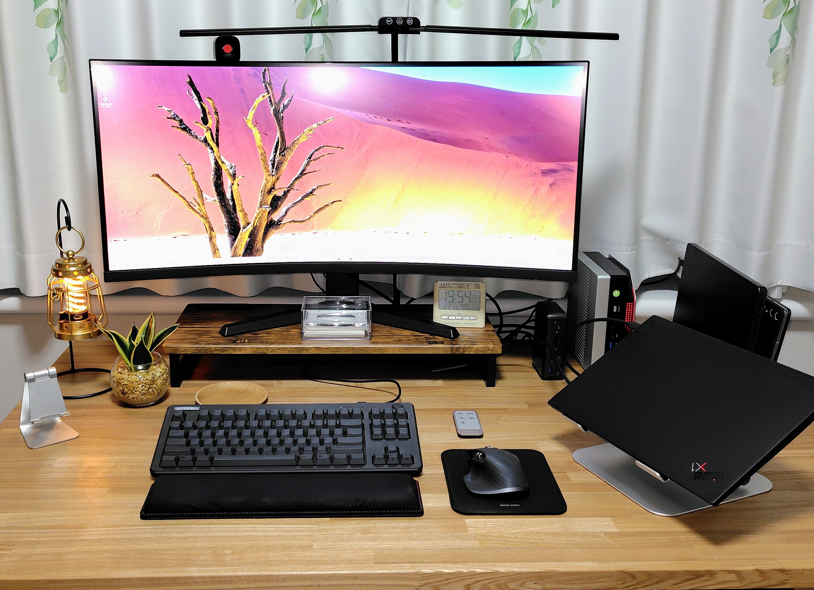

+++
title = "自宅ワークスペース環境2026"
date = "2026-02-21"

[taxonomies]
categories = ["Short Posts"]
tags = ["prose", "gadget"]

[extra]
cover = "workdesk-202602.jpg"
+++

最近自宅のデスク環境を大幅にアップデートしたので，ガジェットの型番メモと，現状スナップショットです。

## After

アップデート後のデスク環境はこうなりました。あらためて写真で見ると，後ろの配線がごちゃついているのが気になります。あと，しかたないのだけれど全体に黒いので雰囲気がずっしりしています。

## 差分

[1年前の環境](https://blog.mocobeta.dev/posts/20250301-prose-work-env/)との違いは，KVMスイッチとドッキングステーションを導入したことと，モニターをウルトラワイドモニターに変えたこと。
これまでUSBハブとBluetoothの複数台接続で複数PCをだましだまし切り替えて使っていたのを，KVMスイッチ＋ドッキングステーションに移行しました。
リモコン操作ひとつでキーボード，モニター，マウスが一式まとめて切り替わるようになり，当社比でQuality of Desk Lifeが爆上がりしました。

あとデスクもひとまわり大きくなり，さらになぜかハイエンドミニPCが増えました。
そろそろ沼っているのかもしれない。

## ガジェット（と家具）リスト

- デスク: 清水材木店 タモ無垢材のオーダーデスク。 幅130cm, 奥行き80cm。
  - 一生使うと決めて購入。大事に使います！
- 椅子: オカムラ CG-M (肘あり)
  - 安価だけど丈夫で，軽くて小回りがきく。男性には小さいかもしれない
- ラップトップ: ThinkPad X1 Carbon Gen 11 (Core i7 / 32GB RAM / ストレージ 1TB / ディプレイ14型)
  - ThinkPad信者なのでN代目
  - とにかく軽い。あと頑丈。OSはArch Linuxに入れ替えている
- ミニPC: GMKtec EVO-X2 (AMD Ryzen AI Max+ / 128GB RAM / ストレージ 2TB)
  - メモリとSSDがこれ以上高騰する前に，と買ってみたコンパクトな怪物PC
  - OSはWindowsとUbuntuのデュアルブートにしている
- KVMスイッチ: Cable Matters 20Gbps USB-C 切替器 3台PC用
  - ThinkPad, EVO-X2, MacBook Pro (会社貸与) をスイッチしている
  - 新しめのWindows, Mac, Linuxだと接続に特に問題なさそう
  - USB4の強いケーブルが3本付属でついてくるのが，地味にお得
  - 超便利。今までなぜ使わなかったのか
- ドッキングステーション: Anker PowerExpand 13-in-1 USB-C Dock
  - PC接続用ポートにはKVMスイッチの出力ケーブルを差して，デバイスはモニター，マウス，キーボード，Webカメラを繋いでいる
  - 超便利。今までなぜ（略
- モニター: KOORUI 34E6UC (34型 / 推奨解像度 WQHD 3440x1440 アスペクト比 21:9)
  - 初めて買ったウルトラワイド湾曲モニター。大きい。画質綺麗（それはそう）
  - モニター内にウィンドウ２つ並べても十分な幅があるので，ラップトップのほうはクラムシェルでもいけるようになった
  - KVMスイッチで切り替える時に10秒くらいかかり，遅いのがちょっと難点
- モニター台: 山善 (幅59×奥行25×高さ8.5cm)
  - 無垢材デスクの上にのせるとさすがにチープな趣があるがギリギリセーフとしている
- キーボード: REALFORCE R3 (テンキーレス / US配列 / キー荷重45g)
  - REALFORCE信者なのでN代目
  - Bluetoothで4台まで切り替えもできるけれど，KVMスイッチでサッと切り替えたいのとOS起動前（BIOS）でも使うので，今もUSB有線接続一択
  - USBレシーバー対応してくれないかな
- マウス: Logicool MX Master 3S
  - Logi Bolt USBレシーバーをドッキングステーションに差して，無線でKVMスイッチ対応できるのが良い
- マウス（サブ）: Logicool M650
- タブレット: Galaxy Tab S10+ (MediaTek Dimensity オクタコア / 12GB RAM / ストレージ 512GB / ディスプレイ12.4型)
- デスクライト: KableRika LEDダブル光源電気スタンド クランプ式
- Webカメラ: Anker PowerConf C200
- ヘッドセット: Shokz OpenComm 骨伝導ワイヤレスヘッドフォン

## おまけ

- LEDランタン: Barebones エジソンライトスティックLED
  - かわいい
- 植物: サンスベリア（ハイドロカルチャー）
  - かわいい

