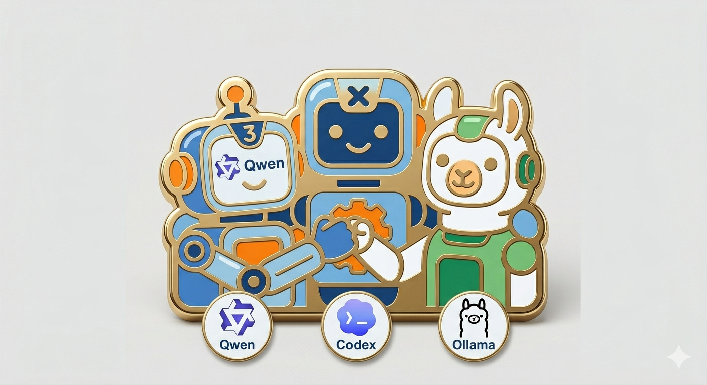

+++
title = "Qwen3-Coderを個人開発用途で使おうと頑張ってみた"
date = "2026-04-06"

[taxonomies]
categories = ["Long Posts"]
tags = ["agentic coding", "codex", "qwen3"]

[extra]
cover = "qwen3coder-codex-ollama.png"
+++



## この記事は何

[Qwen3-Coder](https://qwen.ai/blog?id=qwen3-coder) の30Bモデルを [Codex](https://openai.com/ja-JP/codex/) のバックエンドモデルに指定して，「個人開発レベルで使える」ことを目指しました。

個人開発で十分使える！というのは難しそうですが，用途を選べば使えそう，というところまでは調整できたので，傾向と対策を書いておきます。

## Qwen3-Coder(30B)所感

1か月くらい遊んでみての感想は，

- コーディングができるモデルとして見ると，Qwen3-Coderの実装能力は十分に高い
- 実装はできるけど，抽象度高めのタスクを与えて設計からさせるのはまだむりかも
- tool use や Agent Skill も使える。ただしCodexから使おうとすると調整がいる
- コーディングエージェントとしては，一定の自律性はありつつも，まだまだ伸び代ありそう

です。

２点目はモデルのアップデートを待つしかないので諦めて，３点目と４点目について，ChatGPTと壁打ちをしながらチューニングしました。

## 環境

### ハードウェア
- PC: GMKtec EVO-X2
- プロセッサ: AMD Ryzen AI Max+ 395
- 内蔵GPU: Radeon 8060S
- メモリ: 128GB (うちGPUに96GBを割り当て)

### ソフトウェア
- OS: Ubuntu 24.04
- Graphics API: Vulkan
- LLMサーバー: Ollama
- コーディングエージェント: Codex

という構成です。なおLLMのサーバー(Ollama)とクライアント(Codex)は別PCですが，こまかいのでクライアントについては省略。

## Qwen3-CoderをOllama経由でCodexから使う方法

Vanillaの状態は，Ollamaがセットアップできればすぐに作れます。

[Ollamaのドキュメント](https://docs.ollama.com/integrations/codex)や[Codexのドキュメント](https://developers.openai.com/codex/config-advanced#custom-model-providers)に設定例が載っています。

## Qwen3-CoderをOllama経由でCodexから使う時に困ったこと

（ここから本題）

### Codexが知らないモデルだと警告を出す

無視しても多分大丈夫なのですが，気になる場合はモデルカタログを作ります。`$HOME/.codex/models-qwen3-ollama.json` というようなファイルを（ChatGPTなどで）作って，`config.toml` に指定します。

```toml
model_catalog_json = "~/.codex/catalogs/models-qwen3-ollama.json"
```

Codexのバージョンによってモデルカタログの仕様が変わりますが，2026/3時点では [models-qwen3-ollama.json](https://github.com/mocobeta/dotfiles/blob/main/.codex/catalogs/models-qwen3-ollama.json) で通りました。

※と思ったら，最近のアップデートでモデルカタログを指定しなくても警告が出なくなったようので，いらないのかも

### Codex経由だと起動後の初回レスポンスがものすごく遅い

Ollamaプロセスを確認して，「PROCESSORが100% GPUになっているか（CPUにオフロードされていないか）」と「CONTEXTが65536よりも大きすぎないか」を見ます。前者については説明はいらないかと思います。後者については，コンテキストウィンドウが大きすぎるとKVキャッシュのウォームアップで時間を取られるようで，coding agentで使う際の最小推奨コンテキストウィンドウの64kに近い値を指定すると立ち上がりが速くなります。Ollamaのコンテキストウィンドウサイズの調整方法は，一番簡単なのはollamaサービス起動時の環境変数で`OLLAMA_CONTEXT_LENGTH=65536`のように指定します。

こんな感じになっていたら多分OK

```bash
$ ollama ps                 
NAME               ID              SIZE     PROCESSOR    CONTEXT    UNTIL            
qwen3-coder:30b    06c1097efce0    25 GB    100% GPU     65536      2 hours from now
```

### ツールコールがバグる

既知の不具合のようですが，Qwen3-Coderのツールコール時，こんな感じでしょっちゅう壊れたXMLが返ります。

```xml
<function=exec_command>
<parameter=cmd>
cd website && cat astro.config.mjs
</parameter>
</function>
</tool_call>
```

(最初にあるべき <tool_call> の開始タグがない。)

さらに，ツールコールのレスポンスでJSONを期待するCodexとの相性はあまり良くない気がします。これはQwen3-Coderが悪いわけではなく，ツールコールの仕様が標準化されていないのでしかたない。

**対策1: プロキシ**

Vanillaの状態ではどうしようもないくらいバグるので，OllamaとCodexの間にプロキシを入れて，

1. XMLではなくJSONフォーマットで返させる
2. 壊れたXMLやJSONのレスポンスを無理やりパースして，OpenAI方式のvalidなJSONに変換する
3. ヒストリー長を制限する（大量のメッセージ履歴を渡すとバグりやすいとのこと）

ようにします。

ChatGPTに生成させたプロキシのコードを[こちら](https://github.com/mocobeta/ollama-qwen3-toolcall-corrector/blob/main/main.py)に置いています。（自宅NWに閉じた環境でのサーバーとしては使えるはずですが，プロダクションでの利用に耐えるコードではありません。念のため）

**対策2: インストラクション**

プロキシを入れた上で，インストラクションにもツールコール時の注意を書きます。

[Tool Call Rules](https://github.com/mocobeta/dotfiles/blob/main/.codex/qwen3coder-instructions.md#tool-calling-rules)

この2つの対策で，ツールコールについてはかなり改善します。

### スキルが探せない，探せても実行中に失敗する

これも多分Codexとの相性ですが，Vanilaの状態だとスキルをうまく使ってくれません。インストラクションにスキルについての注意を書きます。

[Skill Handling](https://github.com/mocobeta/dotfiles/blob/main/.codex/qwen3coder-instructions.md#skill-handling)

これで多少マシになります。

### やりますと言ってやらない

"I'll create...", "I will fix..." と言ったまま，実行が止まります。ほんとによく止まるので，Claude OpusやGPT-5.4のようなモデルに慣れていると，笑ってしまうほどにストレスフル。これもインストラクションに注意書きを書くと改善します。

[Continue the task directly](https://github.com/mocobeta/dotfiles/blob/main/.codex/qwen3coder-instructions.md#continue-the-task-directly)

止まらないように強調しすぎると，今度は止まってほしいところで止まらずに暴走するので塩梅に注意。

### やりましたと言ってやってない

"I've fixed...", "I updated..." と言って，実際はやってないことがとても多いです。インストラクションに（略

[Evidence and Completion Rules](https://github.com/mocobeta/dotfiles/blob/main/.codex/qwen3coder-instructions.md#evidence-and-completion-rules)

### バックアップファイルを作業ディレクトリに作る

`aaa.md`を編集する時に，同じディレクトリに`aaa.md.bak`のようなバックアップファイルを沢山作ってきます。インストラクションに（略

[Temporary Files and Backups](https://github.com/mocobeta/dotfiles/blob/main/.codex/qwen3coder-instructions.md#temporary-files-and-backups)

### Codexがサブエージェントを勝手に起動する

Qwen3-Coderは関係ないのですが，Codexがサブエージェントを起動したがります。

貧弱なマシンでこれをされると困るので，インストラクションで止めます。

[Agent Execution Constraints](https://github.com/mocobeta/dotfiles/blob/main/.codex/qwen3coder-instructions.md#agent-execution-constraints)

でもあんまり効いてないかも。Codexの設定でサブエージェント無効化を設定できてほしい気はする。

### それでもやっぱりバグる

一度何かのきっかけでバグると戻らないので，諦めて新しいスレッドを起動します。

## Qwen3-Coder向けインストラクションの置き場

`$HOME/.codex/AGENTS.md` でも良いですが，グローバルのAGENTS.mdを汚したくない場合は `$HOME/.codex/qwen3coder-instructions.md` のように分けておき，`config.toml` でモデル特有のインストラクションファイルを指定できます。

```toml
model_instructions_file = "~/.codex/qwen3coder-instructions.md"
```

## おまけ：MCP

問題なく使えました。Codexに設定しておけばOK

Web検索エンジンは，有償無償のツールがさまざまありますが，[Ollama Web Search](https://docs.ollama.com/capabilities/web-search)も制限ありで無料でも使えます。こちらはWeb検索APIを公開しているのみでMCPサーバーは自前で用意する必要がありますが，ローカルで立てる程度の簡易なサーバーであればさっと作れます。そのうち公式MCPサーバーを出してくれないかな？

## 実装について

Codexの設定やインストラクションは[このリポジトリ](https://github.com/mocobeta/dotfiles/tree/main)で公開しています。

Ollama proxyのコードは[このリポジトリ](https://github.com/mocobeta/ollama-qwen3-toolcall-corrector)で公開しています。

## なぜCodex? Qwen Code使わないの？

Qwenシリーズに最適化された [Qwen Code](https://qwen.ai/qwencode) があるので，素直にこっちを使うのがいいとおもいます。ただ私は複数のツールを使い分けるのが得意でないので...

## 今後とか

15年以上前に docomo HT-03A (日本初のAndroid機) に飛びついて遊んでいた頃の気持ちを思い出しました。たとえが古いな。

もちろんAnthropicやOpenAIやGoogleのプロプライエタリかつ巨大なモデルに比べると，品質という点ではまだとても粗いけど，今後どんどん進化するだろうなあ，と期待させてくれます。オープンソースモデルの開発に投資が続きますように。